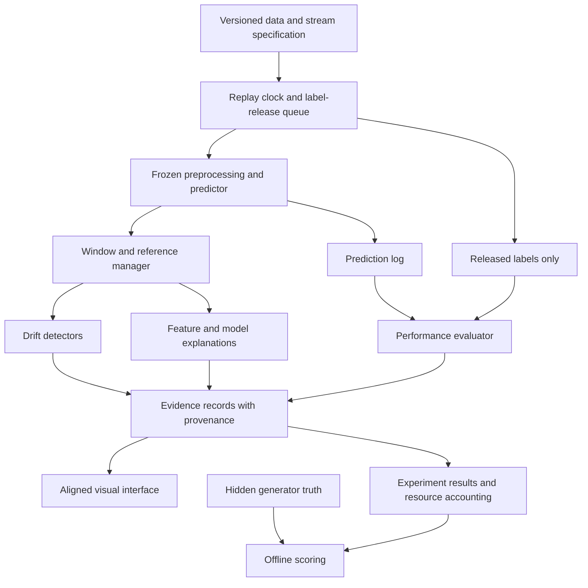

# Research Project Architecture and Roadmap

**Research topic:** Explainable Visualization and Monitoring of Machine Learning Data Drift in Dynamic Environments  
**Document type:** Strategic research blueprint; no implementation or experimental results  
**Prepared:** 28 September 2026  
**Revision:** 2 — critical review and detailed research/engineering execution plan  
**Operating constraint:** Google Colab, at most 15 GB RAM, intermittent sessions, and limited GPU availability  
**Planning horizon:** Approximately 14 weeks, subject to course deadlines, pilot measurements, and participant availability

**How to use this document:** Read Sections 1–5 for the research argument; use Sections 6–10 to freeze the scientific protocol; follow Sections 11–13 for engineering and research operations; use Sections 14–16 for reviews, weekly delivery, and release. Numerical defaults are proposed pilot settings until the protocol is frozen. They are not measured results or externally mandated standards. The companion [critical review](Research_Project_Roadmap_Critique.md) records the weaknesses identified and the revisions made.

## 1. Executive Summary

Develop a reproducible, resource-conscious study of **whether an aligned view of drift evidence, feature explanations, and delayed model performance helps analysts diagnose change and choose appropriate monitoring actions**. Start with tabular classification and replayed streams. Make the visualization an experimental treatment, backed by measured detection, explanation, and decision outcomes.

The central problem is that a distribution-change alarm does not establish model failure, identify a causal mechanism, or tell an analyst whether enough evidence exists to act. The proposed study will examine those distinctions explicitly. Its main contribution should be an evaluated diagnosis workflow and an auditable evaluation protocol. A new detector is a possible later contribution only if the literature review and experiments establish a specific need.

Use the three selected papers as complementary foundations:

- **DriftLens:** reference-based monitoring, aggregate and predicted-class views, and representative examples.
- **Domino Drift Effect (DDE):** feature evidence, inference about unmonitored features, and the cost–accuracy trade-off of selective monitoring.
- **Proactive Hoeffding Trees:** the importance of predictive impact and the limits of anticipating future changes.

These are different research tasks, so their published scores must not become a common leaderboard. The [Phase 1 report](Phase1_Drift_Report.tex) already identifies this distinction and proposes aligning evidence on the same windows. This roadmap turns that direction into decisions, experiments, and completion gates.

**Recommended core scope:** controlled synthetic streams, one natural temporal benchmark, one semi-synthetic tabular benchmark, simple statistical detectors, two modest predictive models, feature-level explanations, and a controlled analyst-task study. Run the core on CPU. Defer deep encoders, DDE replication, and proactive adaptation to separate extension gates.

Success means producing credible evidence about when the workflow helps, when it does not, and what it costs. Publication quality depends on that evidence and its distinction from prior work; neither positive results nor a Q1 acceptance can be promised.

The operating model combines established ML research reporting, reproducible data stewardship, and lightweight MLOps. Every important recommendation below has a corresponding owner, record, acceptance check, or decision gate. Adopting a particular commercial platform is optional; making the research traceable and independently verifiable is essential.

## 2. Research Vision

### 2.1 Define the problem precisely

Use this operational problem statement:

> A researcher monitoring a deployed tabular classifier receives incoming feature windows immediately and labels later. They need to distinguish distribution change from demonstrated predictive harm, locate the affected variables or subgroups, and decide whether to continue observing, investigate data quality, request labels, or evaluate a model update.

The intended user is an ML practitioner or a suitably trained graduate student. The deployment setting is simulated by chronological replay, not by building a production streaming service.

Maintain the following distinctions throughout the study:

| Concept | Evidence available | Permitted interpretation |
|---|---|---|
| Input distribution change, `P_t(X)` | Unlabeled feature windows | The observed inputs differ from a specified reference |
| Conditional concept change, `P_t(Y given X)` | Labels plus appropriate analysis, or controlled generator knowledge | The feature–target relationship changed; an unlabeled alarm alone cannot establish this |
| Predictive degradation | Previously logged predictions paired with subsequently released labels | A specified performance measure worsened; degradation alone does not identify its cause |
| Drift explanation | Feature comparisons, affected groups, examples, and model-behavior evidence | A statistical account of the observed change, not a causal root-cause claim |
| Proactive warning | Information available before a later, predefined degradation outcome | A forecast to be tested separately from contemporaneous association |

A pure conditional change can leave `P(X)` unchanged and therefore be invisible to every feature-only detector. Include that case deliberately. Also include detectable input changes that leave predictive performance largely unchanged. These are necessary tests of an honest monitoring interface.

### 2.2 Scope and boundaries

The core study covers classification, batch-window monitoring, fixed predictive models, delayed labels, controlled drift, and retrospective natural-stream analysis. Start with binary synthetic cases; use the real benchmark's native label structure where feasible. Include multiclass Covertype as an external-validity check rather than silently converting every task to balanced binary classification.

Freeze each predictive model during the principal monitoring experiments so that changing model behavior does not obscure changing data. Study online learning or retraining only in an optional, separately evaluated branch. The interface should support an analyst's decision to investigate or evaluate retraining; it should not automatically execute adaptation in the core project.

The broader vision is a monitoring workflow in which every visible claim has a source, an observation time, a reference version, and an uncertainty or evidence-status indicator.

## 3. Research Journey Roadmap

### 3.1 Use the literature to make design decisions

Read methods, assumptions, evaluation protocols, failure cases, and released artifacts—not only abstracts or headline results. For each paper, maintain an evidence matrix containing the task, data modality, label requirements, reference construction, drift ground truth, baselines, tuning budget, metrics, resource accounting, explanation evaluation, and reproducibility status. Record section or table locators and separate author claims from the project's interpretation.

| Foundation and source locator | What it contributes to this plan | What needs separate investigation | Architectural or experimental consequence |
|---|---|---|---|
| [DriftLens local text](Selected_Papers/01_Greco-2025-DriftLens-TKDE-arXiv-2406.17813.md), Sections IV, V-E, VI | PCA/Gaussian representation monitoring, predicted-label grouping, and on-demand prototypes | Small-group estimates, higher-order changes, and whether explanations improve analyst tasks | Retain group sample counts, raw feature evidence, and a separate human evaluation; do not call a tabular distance baseline an exact DriftLens replication |
| [DDE local text](Selected_Papers/04_Szucs-Nemeth-2025-DDE-KAIS.md), Sections 4.2–4.3, 5.3, 6 | Estimation of unmonitored feature drift from observed co-drift and correlations | Initialization dependence, isolated feature changes, and agreement with detector-derived targets | Distinguish directly measured from inferred feature evidence; compare against full monitoring and matched-budget random subsets |
| [Proactive-tree local text](Selected_Papers/05_GuerreroCano-2026-Proactive-Drift-ML.md), Sections 4.2, 5, 7–8 | Explicit evaluation of predictive performance and adaptation under evolving streams | Predictability assumptions, delayed feedback, irregular changes, and adaptation overhead | Align performance with the original prediction windows; keep adaptation separate from detection evaluation |
| [Phase 1 report](Phase1_Drift_Report.tex), gap synthesis and next-stage protocol | Joint evidence, performance relevance, and credible explanations | Whether the combination improves decisions under realistic information constraints | Connect every proposed contribution to a falsifiable experiment |

Preserve the report's useful direction, but refine two points. Covertype is a tabular classification dataset, not evidence by itself of a natural temporal process; its induced stream should be labeled semi-synthetic. Also, the proactive-tree paper includes additional sensitivity and resource analyses: describe its emphasis on incremental drift without claiming it never investigates other settings.

### 3.2 Extend the review before claiming novelty

The three papers establish the starting point, not exhaustive coverage. Search detection, drift explanation, visual analytics, delayed-label monitoring, performance estimation, and resource-constrained monitoring separately. Use queries such as “concept drift explanation feature localization,” “visual analytics drift analyst evaluation,” and “delayed labels model monitoring.” Search the relevant scholarly indexes, follow backward and forward citations, and log query, date, inclusion decision, and access status. Review the search again before submission.

Include earlier visual analytics because [DriftVis](https://arxiv.org/abs/2007.14372) already connects distribution change to model accuracy, while [ConceptExplorer](https://arxiv.org/abs/2007.15272) supports exploration and comparison of drift across sources. These papers rule out a broad claim that combining drift and visualization is itself new.

A supplementary search also surfaced [Profile Drift Detection](https://doi.org/10.1016/j.future.2026.108586), whose publisher abstract describes using partial dependence profiles for explainable monitoring. Treat it as a priority full-text review candidate, not a fully assessed comparator or evidence of a remaining gap. This limited check does not verify the proposed project's novelty.

The Phase 1 report says the course requires 8–10 qualifying papers and currently counts three. If that requirement remains applicable, add 5–7 qualifying original studies after screening; background sources do not automatically satisfy it. Verify publication year, article type, and the course's required ranking system. Do not inherit a journal's quartile across years or confuse SJR with JCR.

### 3.3 Stage the work through evidence gates

| Stage | Indicative weeks | Required artifact | Decision gate |
|---|---|---|---|
| Problem and literature | 1–2 | Evidence matrix, scope statement, closest-work comparison | A narrow unresolved question is supported; otherwise reposition the contribution |
| Protocol and data audit | 3 | Dataset cards, hypotheses, split manifest, metric definitions | No leakage, usable provenance, and feasible independent evaluation units |
| Feasibility pilot | 4 | CPU runtime/RAM report and small baseline replay | Core runs fit Colab with restart support; freeze affordable settings |
| Detection and explanation study | 5–7 | Baseline results, ground-truth checks, initial failure cases | Detection and localization evaluation are valid before interface polish |
| Visual workflow and pilot tasks | 8–9 | Research prototype, task rubric, usability pilot | Both interface conditions are usable and tasks do not reveal their answers |
| Locked experiments and analyst evaluation | 10–11 | Complete confirmatory runs and participant records | Prespecified analyses completed or deviations documented |
| Analysis and robustness | 12 | Effect sizes, uncertainty, ablations, negative cases | Claims survive fair comparisons or are narrowed |
| Writing and reproducibility audit | 13–14 | Manuscript, artifact package, reproduction record | Independent rerun and claim-to-evidence review succeed |

Start participant recruitment and any institutional ethics process during the protocol stage. If the schedule is shorter, reduce extensions first; preserve the controls, data integrity checks, and core evaluation.

### 3.4 Lessons from the original figures and tables

The following checks used the supplied image assets and complete corresponding PDF pages, not only extracted prose. Page numbers below refer to PDF page positions. Values remain within their original experimental settings and are not forecasts for this project.

| Visually checked evidence | Observation | Consequence for this roadmap |
|---|---|---|
| DriftLens, Figure 4, PDF p. 6: [monitor image](Selected_Papers/01_greco_assets/figures/Fig-04_p06_Figure-4-shows-a-drift-monitor-example.-The-top-chart.png) | The existing monitor already aligns aggregate and per-label distribution-distance curves, with time/window identifiers and warnings | A new timeline alone is not a contribution; test the additional value of aligned feature evidence, delayed performance, and decision support |
| DriftLens, Table IV and explanation text, PDF p. 12: [purity table](Selected_Papers/01_greco_assets/tables/Table-04_p12_Table-IV-Drift-explanation-evaluation.-Purity-score-for.png) | Reported purity ranges from 0.73 to 0.92 for selected affected labels and settings; some larger-window cells are unavailable | Cluster purity is not analyst understanding. If prototypes are evaluated, compare purity against the actual within-group class balance and account for cluster count; also evaluate task usefulness |
| DDE, Table 4, PDF p. 17: [Heartbeats performance table](Selected_Papers/04_szucs_assets/tables/Table-04_p17_Table-4-Performance-measures-as-a-function-of.png) | At 25% monitored features, DDE-ADWIN reports recall 0.9930 but precision 0.3964 and F1 0.5666; DDE-JS has a different trade-off | High recall alone can conceal excessive feature warnings. Report precision, F1, and burden at each budget, and avoid treating all underlying detectors as interchangeable |
| DDE, Table 9, PDF p. 20: [Heartbeats runtime table](Selected_Papers/04_szucs_assets/tables/Table-09_p20_Table-9-Runtimes-of-the-methods-on-the.png) | At 70 monitored features, the ADWIN rows report 178.9 seconds for DDE and 178.5 for reduced monitoring, against 714 for full monitoring | Most of this reported runtime reduction accompanies the smaller monitored subset. Test DDE's added inference value against equally small subsets, rather than attributing all savings to inference |
| Proactive trees, Table 10, PDF p. 43: [window sensitivity table](Selected_Papers/05_guerrero_assets/tables/Table-10_p43_Table-10-Prequential-accuracy.png) | The table varies proactive windows from 500 to 5,000 and marks 1,000 as the default for that experiment; the same page contains resource-analysis discussion | Window sensitivity and resource analysis already exist in the paper. The new question concerns their behavior under this project's information and compute constraints |
| Proactive trees, Table 14, PDF p. 46: [real-stream results](Selected_Papers/05_guerrero_assets/tables/Table-14_p46_Table-14-Aggregation-compari.png) | Real-stream aggregate prequential accuracy is 0.7654 for VFDT and 0.7661 for PHT-S; the table specifies a proactive window of 500 | Do not transfer the larger synthetic gains or a universal 1,000-row adaptation window to natural streams. Separate synthetic and real results and distinguish adaptation-window size from evaluation-window size |

These observations reinforce a conservative contribution: evaluate evidence quality and decision usefulness under controlled conditions instead of assuming that attractive curves, high recall, or synthetic adaptation gains imply operational benefit.

### 3.5 Literature-review operating procedure

Treat the review as a reproducible research activity. Use one shared bibliographic library with DOI/arXiv identifiers and a BibTeX export. Merge duplicate preprint/journal records but preserve version differences that affect methods or results. Keep copyrighted full texts in permitted private storage and release bibliographic metadata and your own summaries where appropriate.

| Step | Required action | Record and completion check |
|---|---|---|
| Define coverage | Separate the three core papers, closest competing systems, methodological background, and course-eligible papers | Search protocol states databases, date range, languages, inclusion criteria, and review cutoff |
| Search | Search at least one broad scholarly index and relevant publisher/discipline indexes; follow citations from the closest work | Exact query, date, index, number retrieved, and export location |
| Screen | Screen titles/abstracts, then full methods; exclude by a stated reason, not by whether results support the project | Deduplicated screening sheet and reason codes |
| Extract | Capture data, labels, assumptions, methods, tuning, metrics, resource use, evidence type, and artifact availability | Evidence matrix with precise section/table locators |
| Challenge | Have a second team member inspect all closest competitors and disputed exclusions; a solo researcher seeks supervisor spot checks | Reviewer initials, disagreement, and resolution |
| Translate | For each proposed gap, name the closest method, what it already covers, and the unresolved condition | Gap-to-experiment row; no gap based only on absence from three selected papers |
| Refresh | Repeat the targeted search before protocol freeze and before submission | Dated delta log showing added papers and effects on claims |

Recommended evidence-matrix fields are: paper identifier, bibliographic version, research task, input modality, model/label assumptions, dataset provenance, drift truth, sample/event counts, reference policy, baseline information access, tuning effort, statistical unit, explanation target, human evaluation, total cost, limitations, replication route, source locator, and relevance to a specific RQ. Mark inaccessible or unverified details explicitly.

Call this a structured literature review unless it actually meets the completeness and reporting requirements of a systematic review. A search log improves auditability; it does not make an incomplete search exhaustive.

## 4. Research Question Strategy

### 4.1 Main question

**Under a fixed Colab-scale resource budget and delayed label availability, does an aligned visualization of drift scores, feature-level explanations, and observed model performance improve analysts' diagnosis and evidence-appropriate action choices compared with conventional separate monitoring views?**

Define “improve” before collecting confirmatory results. Use analyst task correctness as the primary endpoint and task time as a secondary endpoint. Select a smallest practically meaningful difference using the pilot and supervisor judgment, then lock it; do not choose it after seeing the main results.

### 4.2 Supporting questions, hypotheses, and experiments

| ID | Supporting question and directional hypothesis | Evidence needed | What would weaken the claim? |
|---|---|---|---|
| RQ1 / H1 | At a comparable false-alert burden, can the selected detectors find controlled input changes within useful delays? | E1: stable and drifted streams, event recall, delay, false alerts | Gains disappear after matching false-alert rates or occur only for large, easy shifts |
| RQ2 / H2 | Do feature explanations locate manipulated variables more accurately than simple reference rankings? | E2: known changed-feature sets, ranking and selection metrics | Explanations track correlated proxies or fail on isolated shifts |
| RQ3 / H3 | Does an unlabeled drift score add useful out-of-time information about later predictive degradation beyond a simple history-based baseline? | E3: predefined future outcome, information cutoff, chronological evaluation | No incremental predictive value, unstable sign, or apparent benefit caused by future labels |
| RQ4 / H4 | Does the aligned interface improve task correctness over separate views containing the same underlying evidence? | E4: counterbalanced analyst study, matched scenario difficulty | No meaningful gain, increased overconfidence, or a material time penalty |
| RQ5 / H5 | Where co-drift is present, can selective monitoring preserve useful localization at lower total cost? | E5 extension: DDE or clearly labeled adaptation, budget-matched subsets | Savings vanish after initialization and maintenance, or isolated changes are systematically missed |

RQ4 is the principal contribution claim. RQ1–RQ3 establish the quality and limits of the evidence being displayed. RQ5 is conditional on time and successful replication. A visualization that uses identical detector outputs cannot improve the detector's numerical accuracy merely by displaying them differently; it can improve human detection and interpretation, which must be measured separately.

H2 becomes a superiority hypothesis only if the chosen explanation method differs meaningfully from the raw feature-distance ranking. If the core explanation is that same ranking with clearer presentation, evaluate its localization accuracy and limits directly; test presentation benefits through H4 rather than claiming algorithmic improvement over an identical baseline.

### 4.3 Convert questions into a registered analysis plan

For every hypothesis, specify the population of streams or users, manipulated factor, comparator, primary endpoint, analysis unit, exclusions, information available at decision time, and smallest useful effect. Define one primary contrast for the analyst study and a small number of secondary contrasts. Mark exploratory analyses explicitly.

Treat a null or negative result as a possible outcome. For example, finding that drift scores fail to forecast loss under pure conditional shifts can strengthen the monitoring limitations analysis without supporting a forecasting claim.

### 4.4 Research charter and decision register

Before implementation, record the following decisions in `experiments/protocols/research_charter.md`. The research lead owns the document and the second researcher or supervisor challenges it.

| Decision | Proposed direction | Must be resolved by |
|---|---|---|
| Primary contribution | Improvement in evidence interpretation and action correctness through aligned visualization | End of week 2, after closest-work comparison |
| Intended users | Graduate researchers or ML practitioners with documented monitoring knowledge | Week 3; recruitment must match the eventual claim |
| Participant-study feasibility | Confirm an attainable sample and an institutionally acceptable procedure | Week 3; a later usability pilot refines tasks |
| Core explanation | Direct feature distributions plus a transparent model-behavior view | Week 4; superiority claims require a genuinely different ranking method |
| Primary user contrast | Aligned versus separate views with the same evidence | Week 3, refined only on pilot material before main recruitment |
| Main compute budget | CPU-only, measured RAM envelope, finite job inventory | Week 4 after profiling |
| Experiment completion rule | Fixed run/sample inventory and precision goal selected before confirmatory analysis | Protocol freeze, before test access |
| Contribution fallback | If a human study is infeasible, an empirical monitoring/evaluation study with a different primary claim | Decide before confirmatory outcomes; record it as a protocol amendment |

The fallback is not permission to rename a failed user experiment as a successful different project after seeing its results. If H4 is tested and fails, report that result. Any further study is a separately labeled exploratory or follow-up study.

## 5. Contribution Strategy

### 5.1 Recommended contribution package

1. **Methodology contribution:** an explicit protocol for aligning detected change, feature evidence, delayed labels, and predictive impact while preserving what was knowable at each time.
2. **Evaluation contribution:** a reproducible comparison spanning known-feature injections, harmless shifts, harmful changes, missing labels, and natural-stream uncertainty under a measured compute budget.
3. **Visualization contribution:** a task-oriented interface that distinguishes measured change, inferred change, unavailable evidence, and observed harm, evaluated against an information-matched alternative.
4. **Research artifact:** dataset manifests, replay specifications, results, task materials, and a Colab reproduction path.

These are candidate contributions. Their novelty must be established relative to the closest work, and their value must be measured. A directory structure, dashboard, or combination of existing libraries is supporting engineering rather than sufficient scientific novelty.

### 5.2 Decide whether a new algorithm is justified

First identify a repeatable failure of the strongest affordable baseline. Then determine whether a bounded change—such as improved evidence calibration or selective-monitoring safeguards—addresses that failure without increasing another error. Only pursue it if an isolated ablation can test the mechanism and it remains within the resource budget.

If the literature already covers the intended interface behavior, pivot to an empirical contribution about delayed labels, false reassurance, or resource–explanation trade-offs. Do not invent a composite drift score solely to create an algorithmic claim.

### 5.3 Separate core and optional extensions

| Core deliverable | Extension admitted only after the core gate |
|---|---|
| Full feature monitoring and direct distribution explanations | DDE-style inference on 100–200 feature synthetic streams |
| Fixed-model performance monitoring with delayed labels | Reactive versus proactive adaptation using a faithful reference implementation |
| Tabular data and small models | One cached-embedding case using a frozen small encoder |
| Human diagnosis and evidence-appropriate actions | Measured downstream retraining utility under a specified action policy |

At most one extension should enter the first manuscript unless measured resources and the schedule clearly permit more.

## 6. System Architecture Planning

### 6.1 Design around information flow

Choose component boundaries before choosing libraries. Each layer should expose a versioned, testable data contract and persist only what the next layer needs.



Generator truth belongs only to offline scoring. It must not enter detectors, explanations, model training, or participant views. The label-release queue controls when labels become available to every downstream component.

| Layer | Responsibility and output | Key design decision |
|---|---|---|
| Data | Immutable sources, schema, licenses, checksums, event identifiers | Natural chronology versus explicitly constructed replay |
| Preprocessing | Training-fitted imputation, scaling, encoding, missingness flags | Preserve raw feature meaning and map encoded columns back to source variables |
| Drift simulation | Versioned scenario, affected variables, onset/transition interval, severity, seeds | Whether the intervention changes inputs, labels, dependence, or measurement quality |
| Prediction | Frozen model, class probabilities, model version, prediction timestamp | Small tree for inspectability; logistic model for model-family sensitivity |
| Window/reference | Window boundaries, baseline snapshot, sample counts, version | Fixed reference in the main study; refresh policy only in a separate ablation |
| Detection | Raw statistic, calibrated alert, threshold, assumptions, runtime | Comparable false-alert burden and modality-appropriate tests |
| Explanation | Ranked feature effects, before/after distributions, optional model attribution | Direct versus inferred evidence, stability, and bounded computation |
| Evaluation | Event/feature matching, released-label performance, uncertainty, costs | Separate oracle evaluation truth from operational information |
| Visualization | Synchronized views and task interaction log | Evidence availability and uncertainty must remain visible |
| Experiment orchestration | Configuration, seeds, checkpoints, manifests, failure status | Sequential CPU runs and restartable units |

### 6.2 Define the evidence record

An evidence record should identify the run, dataset version, scenario, model, preprocessing version, reference version, window start/end, observation time, score and units, threshold, group/sample count, measured or inferred status, and compute cost. Performance records additionally need label coverage, label release time, metric definition, and the prediction window to which they refer.

The interface joins records by explicit identifiers. It must not silently align an alert from one window with an accuracy value calculated on another. Operational replay must reproduce the screen as it could have appeared then; retrospective analysis may show subsequently revealed labels with a clear availability marker.

### 6.3 Adopt a CPU-first resource envelope

The following are planning caps, not measured performance claims or guarantees about Colab allocation. Profile them in week 4 and reduce them if necessary.

| Component | Initial envelope | Resource rationale and fallback |
|---|---|---|
| Synthetic stream | About 50,000 rows, 20–50 variables; generated or loaded in chunks | Enough for several phases without large resident tables; reduce scenarios before independent repetitions |
| Long stationary controls | Separate generated controls, initially 1,000 monitoring windows per seed | Estimate false-alert behavior beyond short traces; stream rows and retain summaries rather than loading the whole sequence |
| Semi-synthetic Covertype | Fixed documented subset up to 100,000 rows | Preserve all selected labels and feature groups; chunk full data only if justified |
| Monitoring windows | Main window 500 rows; sensitivity 250 and 1,000 | Small CPU work units; assess minority-group support before reporting group statistics |
| Historical reference | Up to 5,000 training-period rows plus frozen summaries | Avoid unbounded historical storage; record sampling and its seed |
| Models | One depth/size-capped tree and one regularized logistic model | CPU training, limited tuning, interpretable comparisons; avoid large ensembles initially |
| Explanations | Feature summaries on every window; model attribution on selected windows, at most 100 examples and a fixed small background if needed | Cache outputs once and reuse for UI experiments; fall back to transparent model rules and direct distribution evidence |
| Resident RAM | Target below 8 GB, investigate above 10 GB, stop before approaching 15 GB | Leave room for Python, notebooks, array copies, plots, and serialization |
| Run duration | Target 5–20 minutes per independently resumable unit | Checkpoint at boundaries; subdivide a run if pilot measurements exceed the target |
| GPU | Zero required for the core | Optional embedding extraction must be batched and cached; cancel the extension if access is unreliable |

For scale, 100,000 rows × 200 numeric features × 4 bytes is approximately 80 MB for one dense float32 array. This is not the process memory: dataframes, copies, models, temporary matrices, and rendering can multiply it. Measure peak resident memory. Avoid full pairwise sample-distance matrices, retaining every transformed dataset in RAM, and parallel runs in one Colab session.

### 6.4 Specify component contracts and replay order

Use an explicit replay clock with separate sample/event time, prediction time, label-availability time, and processing time. A measured latency is a wall-clock duration; a detection delay is a position in the stream. Neither substitutes for the other.

At each replay step, process newly arrived features with the currently authorized preprocessing/model state, persist the predictions, then make labels whose release condition is met available to the evaluator. Even the zero-delay condition must predict before observing its label. For a window-based delay `d`, release the labels of window `t` after its predictions are logged and the replay has reached the declared release boundary for `t + d`. Use one documented boundary convention in every experiment. The main model is frozen; an optional adaptive learner may update only after release.

| Contract | Minimum fields | Invalid input or missing evidence behavior |
|---|---|---|
| Sample | Dataset/version, event ID, event time or replay index, raw feature schema | Stop or quarantine malformed records according to a fixed rule; record the count |
| Prediction | Event ID, model/preprocessing versions, prediction time, class and probabilities if supported | Never recompute historical predictions with a newer model and overwrite them |
| Window | Unique window ID, first/last event, stride, count, reference version | Represent partial/final windows explicitly; use a declared inclusion rule |
| Detection | Window ID, method/version, statistic, units, threshold, alert decision, availability time | Store unavailable/numerical-failure status, not a fabricated zero |
| Explanation | Window, target, original-variable mapping, measured/inferred status, support, selection policy | Report unsupported inference and small-group suppression explicitly |
| Label | Event ID, value, release time, optional observation-selection flag | Reject unmatched/duplicate joins; do not backdate newly released evidence |
| Evaluation | Window/prediction IDs, metric version, coverage, eligibility, uncertainty method | Keep undefined metrics and missing labels distinct from poor performance |

Label delay changes performance availability but does not change input-detector outputs in the frozen, label-independent core. Replaying cached scores is valid there. It is invalid if labels affect reference refresh, monitored-feature selection, explanation fitting, supervised drift detection, or adaptive model state; those branches require a separate replay.

Keep a fixed historical reference in the main study. A return to the historical distribution is a recovery relative to that reference, while a transition detector may treat it as another event. Declare each detector's reference semantics so recurrence results are not scored against an incompatible event definition.

## 7. Dataset Strategy

### 7.1 Use complementary evidence tiers

| Tier | Recommended data | Research role | Ground truth and limitation |
|---|---|---|---|
| A: controlled | A transparent tabular generator with relevant, irrelevant, correlated, and independent features | Exact tests of event detection, localization, and failure cases | Record generator changes independently of detector outputs; synthetic realism is limited |
| B: natural temporal | Electricity/Elec2 as the first candidate; Weather only after exact source and timestamp verification | Chronological external-validity case with naturally evolving observations | Do not assume a catalog of true drift events; performance and alarm patterns can be observed without verified event labels |
| C: semi-synthetic | Covertype with documented replay order and controlled feature interventions | Multiclass data, realistic feature structure, and known intervention locations | Intervention truth is known; natural chronological drift is not established |
| D: optional | One of the DDE study's higher-dimensional datasets, subject to provenance and preprocessing audit | Test selective monitoring where feature count matters | Detector-derived labels remain agreement targets rather than independent drift truth |

The official [Elec2 documentation](https://riverml.xyz/latest/api/datasets/Elec2/) describes a binary electricity-price-direction task. The [UCI Covertype record](https://archive.ics.uci.edu/dataset/31/covertype) lists 581,012 observations and 54 features for seven cover types. Their sizes and provenance support candidate selection; neither source supplies complete feature-level drift truth for this project's evaluation.

### 7.2 Audit before selection

For each candidate, establish download stability, redistribution terms, version, schema, target definition, chronological ordering, prediction-time feature availability, duplicate policy, missingness, categorical validity, subgroup sizes, and class imbalance. Document any normalized or preprocessed upstream version whose fitting period is unknown. Do not present such data as a pristine deployment simulation.

Admit a dataset only if it has a clear role not already fulfilled by another dataset, fits the resource cap, and can be reproduced from a manifest. If Weather's variant or chronology cannot be established, omit it rather than filling a dataset-count target with ambiguous evidence.

### 7.3 Design controlled drift cases deliberately

Cover stable operation, abrupt marginal shift, gradual transition, recurrence, correlated-feature change, isolated-feature change, joint dependence change with preserved marginals, and pure conditional change with stable inputs. Include harmless changes in irrelevant variables, minority-subgroup harm, class imbalance, and missingness as focused stress tests.

Specify whether each feature intervention changes an underlying variable or only its recorded measurement. Transforming a feature while retaining its original label can simulate sensor corruption; it does not automatically preserve `P(Y given X)`. For synthetic covariate-only cases, generate labels from the same fixed conditional rule after changing the input distribution. For conditional-only cases, change the labeling rule while holding the input generator fixed.

Keep categorical values valid and group one-hot columns into their original variable. Record every intervention's onset, transition duration, affected original variables, mechanism, seed, and intended severity. Validate the realized distribution change and predictive effect offline; intended severity is not a substitute for measured impact.

### 7.4 Partition time and information

Use an initial training period, a subsequent calibration/development period, and a locked final evaluation period. An initial allocation might be 20% / 20% / 60%, adjusted before testing to provide enough calibration windows and minority observations. Fit encoders, scalers, imputation, models, and any PCA only on their authorized historical split.

Threshold calibration should include controlled stationary data; do not label an arbitrary natural prefix drift-free without evidence. Use separate development scenarios to choose settings and held-out scenario seeds and timings for confirmation. Do not shuffle a natural stream or bootstrap isolated rows to create a misleading number of independent drift histories.

Release labels after 0, 2, or 5 monitoring windows in planned delay conditions, with 2 as an initial main setting. Synthetic delays are experimental conditions, not claims about a dataset's original acquisition process. Also include an unavailable-label demonstration and, if feasible, one selective-missing-label stress test.

### 7.5 Data management and acceptance records

Prepare a data-management plan before downloading large files. For each dataset, the data card should state source/version, acquisition date, citation/license, original and retained dimensions, target/class mapping, time semantics, train/calibration/test event ranges, transformations and fit ranges, duplicates, missing values, categorical domains, subgroup support, known limitations, storage locations, checksums, and redistribution conditions.

Use three distinct validation classes:

- **Schema validation:** expected columns, types, valid category codes, units, unique identifiers, and ordering. Schema failures are data-quality events, not automatically statistical drift.
- **Historical data-quality assessment:** missingness, duplicates, target availability, class balance, suspicious target-derived features, and upstream preprocessing. Decide handling rules before test inspection.
- **Research-truth validation:** generator parameters, intended interventions, actual changed distributions, and hidden annotation isolation. Record when an intended intervention failed to produce a meaningful realized change.

The data curator produces the card; another researcher checks target leakage and split boundaries before the dataset enters the confirmatory inventory. A missing license or ambiguous ordering is a documented restriction or a reason to reject the candidate. Silent imputation, row deletion, label recoding, and test-set-driven feature selection are unacceptable.

### 7.6 Controlled scenario catalog

Each template receives a versioned scenario card with generation rule, known event truth, original-variable truth, intended model impact, development/confirmation seeds, reference semantics, and output checks. Use the following eight-template core; extend it only through a separately budgeted stress test.

| ID | Template | Known truth and expected diagnostic value |
|---|---|---|
| S0 | Stationary input and conditional process | No intended drift; measures spurious alerts and explanations |
| S1 | Abrupt shift in an irrelevant input | Known changed variable; deliberately tests whether a harmless shift is mistaken for model failure |
| S2 | Gradual shift in relevant input variables under a fixed labeling rule | Known transition interval; measure impact instead of assuming that covariate shift must hurt |
| S3 | Historical state A, shifted state B, then return to A | Score departures from A as drift and the return as recovery for fixed-reference monitoring; assess transition semantics separately |
| S4 | Correlated-group intervention | Track manipulated original variables and correlated proxy evidence separately |
| S5 | Isolated shift outside the optional monitored subset | Tests independent-feature failures of selective monitoring; full monitoring remains the control |
| S6 | Dependence change with unchanged univariate marginals | Tests the limits of marginal tests and the usefulness of a joint detector |
| S7 | Changed label rule with unchanged input process | Feature-only detection should not be expected to identify this event; assess delayed performance evidence |

For S4, preserve a generative dependency specification so direct interventions and downstream changes are distinguishable. For S6, a manipulated relationship may be the explanation target; do not invent a uniquely identifiable single-feature cause. Maintain both feature and relationship/group truth where relevant. Exclude inapplicable cases from a particular localization metric with the reason stated, rather than counting all of them as easy successes or unexplained failures.

Keep drift onset and severity independent of detector output. Select a development severity range that avoids entirely trivial or undetectably tiny cases, freeze it, and evaluate held-out seeds without discarding unfavorable realized effects. Include additional imbalance, minority-harm, missingness, and severity cases only through the ablation inventory.

## 8. Experiment Planning

### 8.1 Build fair baseline families

| Family | Core comparison | Fairness requirement |
|---|---|---|
| Input-change detection | Numeric KS-based monitoring versus normalized Wasserstein monitoring; categorical variables use an appropriate categorical statistic | Same source variables, reference period, stream windows, calibration data, and allowed runtime |
| Joint-change detection | A bounded nonlinear two-sample classifier test, with disjoint fit/evaluation samples and block-aware calibration | Count detector training cost; cap model depth and samples; a purely linear discriminator is not an adequate sole baseline for covariance/dependence changes |
| Localization | Selected explanation ranking versus raw feature-distance ranking and a fixed historical relevance ranking | Same candidate feature universe; label historical relevance as a weak comparator, not a drift detector |
| Predictive impact | Drift score versus most recent available loss/constant-risk baseline | Same information cutoff and forecast horizon; delayed labels respected |
| Visual decisions | Separate conventional panels versus linked aligned panels with identical underlying evidence | Same numbers, features, historical information, training, and task time limits |
| Selective monitoring, optional | Full monitoring, fixed/random subsets, and DDE | Same subset budgets; charge initialization, correlations, curve updates, and confirmation tests |
| Adaptation, optional | Frozen model, fixed-schedule update, reactive update, and a faithful proactive method if feasible | Same labels, base learner where applicable, update data, and compute accounting |

Do not add every method from every paper. In particular, original DriftLens needs appropriate representations and predicted-class handling; original DDE needs a prior drift for initialization; proactive trees are adaptive classifiers. Either reproduce an applicable component faithfully or label the departure explicitly. Never rank their headline published numbers together.

### 8.2 Plan experiments around a purpose

| Experiment | Design | Why it exists |
|---|---|---|
| E0: integrity and feasibility | Small stationary and known-change streams; profiling and replay checks | Establish valid data flow and affordable execution before scaling |
| E1: detection | Shared stable/shifted streams; calibrated alert policies; abrupt, gradual, recurrent, and invisible-to-input cases | Quantify delay versus false alarms and characterize detector limits |
| E2: explanation | Known changed-feature sets; correlated proxies, isolated shifts, grouped variables | Distinguish credible localization from a plausible-looking ranked list |
| E3: predictive relevance | Fixed models, delayed labels, contemporaneous and future outcomes analyzed separately | Test whether alarms relate to harm and whether any advance warning is useful |
| E4: analyst usefulness | Counterbalanced interface study using replayed scenarios and a fixed rubric | Test the visualization contribution directly |
| E5: resource/selective-monitoring extension | Monitoring fractions 25%, 50%, and 100%; co-drift and independent drift | Test DDE-inspired savings under favorable and unfavorable assumptions |
| E6: robustness and ablation | Targeted parameter changes and component removals | Identify which assumptions and components account for results |

### 8.3 Keep the experiment matrix bounded

An initial core inventory is **8 scenario templates × 5 independent seeds × 3 detector configurations = 120 detector runs**. Use separate development seeds first. Reuse these detection outputs across the two fixed predictive models where the detector is model-independent; model-dependent detection would require additional runs. Delay conditions and visual variants should normally be replayed from stored evidence, without recomputing all statistics.

Five seeds are a starting feasibility choice, not a guarantee of statistical precision. Decide the confirmatory seed count from pilot variability and the target effect before unlocking final tests. Real-data runs and focused ablations require their own manifest entries. Preserve paired comparisons on identical streams.

The 120-run count covers only the short synthetic detector comparison. It is not the total project budget. Use the expanded inventory below for scheduling, count cached replays separately from training, and replace all duration assumptions with pilot measurements.

| Work family | Initial count | Reuse and resource rule |
|---|---|---|
| Short synthetic detection | 8 templates × 5 seeds × 3 detector configurations = 120 jobs | Score streams once per detector; shared input evidence can serve both predictive models |
| Natural-stream detection | 1 chronology × 3 detectors = 3 jobs | No claim that repeated seeds create new natural histories |
| Semi-synthetic detection | 1 frozen intervention template × 5 seeds × 3 detectors = 15 jobs | Additional interventions must be added to the inventory explicitly |
| Long stationary validation | 3 independent generator/reference seeds × 3 detectors = 9 jobs | Initially 1,000 windows per seed; chunk each job if needed; use distinct calibration and validation randomness |
| Predictive model fits/traces | (40 short synthetic streams + 1 natural stream + 5 semi-synthetic streams) × 2 models = 92 model-stream jobs | This counts final model fits/traces; development tuning and failed attempts are additional |
| Delay replay | 46 scored streams × 2 model traces × 3 delays = 276 lightweight replay cases | Reuse valid cached outputs; do not count this as 276 retraining jobs |
| Targeted ablations | Initial ceiling of 24 added detector/model jobs | Choose informative paired cases before final tests; no full factorial sweep |
| Analyst study | 2 interfaces; about 12–20 participants provisionally, plus separate pilot | Human time and sample-size adequacy are independent of CPU budgets |

The proposed detector total is **147 jobs before ablations**. The corresponding raw score job count differs from the number of unique streams and must be reported accurately. At an illustrative 5–20 minutes per short/ordinary detector job, 138 such jobs require 11.5–46 CPU-hours; the 9 longer stationary jobs, 92 model jobs, tuning, explanations, ablations, and failed attempts add cost. Extrapolate long-control runtime from per-window pilot measurements rather than applying the short-job assumption.

Maintain a budget worksheet with job family, count, measured median duration, conservative high duration, peak RAM, artifact size, and remaining CPU-hours. Reserve 25% of the estimated compute/time envelope for failures and verification as a project planning choice. Freeze the funded/available envelope with the supervisor; no paid GPU or subscription is presumed. If the budget fails, reduce optional methods and combinations before sacrificing stationary controls or independent repetitions.

### 8.4 Ablations and sensitivity

- **Evidence alignment:** compare linked views to an information-matched unlinked interface; this isolates presentation benefit.
- **Explanation content:** remove feature explanations while preserving detector and performance evidence; this tests the value of additional content, a different question from alignment.
- **Availability indicators:** test clear delayed-label status against a usable conventional status display; avoid deliberately broken controls or concealed missing data.
- **Model attribution:** compare direct distribution explanations with and without bounded model-behavior evidence.
- **Reference policy:** compare a fixed reference to a past-only refresh rule. Log refresh events; a refresh must never erase history silently.
- **Parameters:** vary window size, effect threshold, drift severity, delay, and imbalance individually around the main setting; investigate selected interactions only when scientifically justified.

Freeze feature aggregation, multiple-testing treatment, cooldown, and alert persistence rules before the final comparison. Calibrate false-alert behavior empirically on held-out stationary streams, especially when temporal dependence invalidates textbook test assumptions.

### 8.5 Initial protocol defaults and freeze rules

These defaults make the pilot actionable. They become confirmatory settings only after a dated protocol freeze. Record every adjustment and why it was made using development data.

| Parameter | Pilot default | Freeze/validation rule |
|---|---|---|
| Window and stride | 500 rows, stride 500 | Non-overlapping main windows; 250/1,000 sensitivity does not replace the main result |
| Short synthetic split | 10,000 training, 10,000 development, 30,000 test rows | Place held-out events in the test region with adequate matching horizons; separate long null calibration is still needed |
| Reference | Up to 5,000 historical training rows | Fixed selection rule/seed; test support and stability against reference subsampling |
| Main global alert target | Approximately 10 raw alerted windows per 1,000 stationary windows | A proposed operating point, not a proven false-alarm guarantee; estimate on independent long controls |
| Alert episodes | Consecutive alerted windows form one episode | Report raw burden too; if hysteresis/cooldown is added, predeclare it and keep it common |
| Abrupt event matching | First alarm within 5 windows of onset | Mark misses explicitly; complete horizon required; one-to-one event/episode match |
| Gradual event matching | From transition start through 5 windows after transition end | Report start-relative and end-relative delay; prevent overlap with another event's eligibility interval |
| Localization display | Top 3 original variables plus full ranking on demand | Evaluate declared `k`, group mappings, and no-change cases; do not choose `k` using the true set size |
| Label delay | 2 windows primary; 0 and 5 sensitivity | Use the common release-boundary convention in Section 6.4 |
| Performance outcome | Macro-F1 primary for degradation; balanced accuracy/per-class recall secondary | Report undefined estimates and support; lock degradation threshold using domain relevance and pilot noise |
| Future warning horizon | Next 3 windows as an initial candidate | Fix before confirmation; purge overlapping horizons at splits; avoid future-label leakage |
| Hyperparameter search | Up to 6 development configurations per method/model per dataset family | Same search budget principle, documented space, scores, failures, and tie-breaks; no test tuning |
| Seed count | 5 per short synthetic template initially | Choose final count from precision needs before test access; do not add seeds until significance appears |

For the two-sample classifier, balance the reference/current origin labels, reserve disjoint evaluation observations from both origins, and avoid random row splitting when temporal dependence requires block separation. Origin labels are construction labels, not the predictive task's true labels. Fix a small nonlinear discriminator and training budget; select and calibrate its score using development data. Do not explain the predictive model using this discriminator's feature importance without clearly identifying which model is being explained.

### 8.6 Standard experiment card and execution procedure

Every experiment card contains: experiment/RQ IDs, confirmatory or exploratory status, rationale, independent unit, dataset and scenario versions, exact splits, information cutoff, method/baseline versions, configuration search budget, frozen settings, seeds, predicted result and disconfirming result, primary/secondary metrics, confidence-interval method, exclusions, failure handling, resource budget, owner/reviewer, expected artifact paths, and acceptance checks.

**Before a run:** verify the code/environment revision, data checksums, schema, split boundaries, seed/configuration identity, free memory/storage, and last valid checkpoint. Mark the registry entry running only after these checks.

**During a run:** log progress, timing, memory, missing evidence, alerts, and exceptions; persist complete chunks. Preserve the test-set access boundary and do not edit thresholds mid-run.

**After a run:** verify expected window/event counts, no duplicate IDs, consistent label joins, finite/eligible metrics, and artifact checksums. Mark complete only after the output manifest passes validation. Append failures and retries with distinct attempt IDs under the same scientific run ID.

**Before aggregation:** reconcile planned versus attempted versus completed jobs and explain every exclusion. Use the registered completion policy; never replace the failed seeds with favorable new seeds. Export the inclusion manifest with the results.

## 9. Evaluation Strategy

### 9.1 Detection performance

Define an event-matching policy before evaluation. For abrupt changes, use the known onset; for gradual changes, record both the start and end of the transition. Match the first eligible alert within a predefined horizon to at most one event. Events outside the matching horizon remain misses. Count repeated alarms separately as alert burden instead of giving repeated credit for the same event.

| Dimension | Measure and interpretation | Required qualification |
|---|---|---|
| Event detection | Recall = matched events / evaluable true events; precision = matched alert episodes / all alert episodes under the declared matching policy | Meaningful only where events and stable regions are independently known |
| Delay | First matched alarm time minus event onset, in windows and samples; for gradual drift also report relation to transition end | Report miss rate alongside conditional delay; a fast method that misses most events is not superior |
| False alerts | 1,000 × alerts during known stationary windows / number of stationary windows | Define raw alerts versus cooldown-collapsed episodes and report both operational burden and the primary rate |
| Persistent operation | Time to first false alert and total alert burden across long stable runs | Account for censoring; repeated sequential testing is not controlled merely by per-window p-values |
| Window discrimination | Precision–recall summaries over independently labeled drifted windows | Secondary to event metrics; declare how mixed transition windows are labeled |
| Cost | Median and high-percentile latency per window, total runtime, peak RAM, stored artifact size | Record hardware and include preprocessing, initialization, and explanation separately |

For continuous-feature tests, preserve effect size alongside significance. Use a declared within-window correction, such as Holm adjustment across tested features, where applicable. This does not by itself guarantee a long-run false-alert rate. A permutation or resampling calibration must preserve relevant temporal dependence; if it cannot, report the empirical operating characteristics rather than claiming exact significance.

For natural streams without verified event annotations, report alarm burden and performance associations. Do not call an alarm a false positive merely because no label of drift exists.

**Calibrate with enough observations.** A 10,000-row development block with 500-row windows supplies only 20 windows, which is inadequate to establish a rare long-run false-alert rate. Generate additional stationary calibration windows independently of the final long stationary validation traces. Initially budget at least 1,000 calibration windows per relevant null family, streamed in chunks, then validate on the three independent reference/stream seeds in Section 8.3. Reuse source summaries only when method state and reference semantics permit it. Include calibration cost in the total even though these are not confirmatory detector jobs.

Prespecify null families that represent the assumptions under test, including one temporally dependent stable process if temporal claims are made. A threshold calibrated on independent synthetic rows may fail on autocorrelated natural streams. Report uncertainty and per-reference variability; observing no false alarms does not prove a zero false-alarm probability. Expand null exposure only under a prespecified precision rule, or report that the available exposure leaves the rate uncertain.

For S7 conditional-only changes, report feature-only detectors' blind spot separately from recall on detectable input-change events. A universal aggregate that mixes incompatible detection targets could obscure the actual question. Conversely, do not omit S7 from the end-to-end diagnosis study, where delayed model harm is central.

### 9.2 Explanation quality

Define the explanation target separately for each experiment:

| Target | Metric or validation | Interpretation limit |
|---|---|---|
| Manipulated original variables | Precision, recall, F1, precision at a prespecified `k`, and ranking average precision | Requires generator/intervention truth; use a defined no-change policy where the true set is empty |
| Correlated groups | Group-level recall and proxy-selection rate alongside variable-level scores | A correlated proxy can carry evidence without being the manipulated variable |
| Explanation stability | Top-`k` overlap and rank variability across suitable resamples or repeated streams | Stability alone does not imply correctness; changes near a threshold can be unstable |
| Detector explanation fidelity | On synthetic data, restore known manipulated variables and measure score response; compare with restoring irrelevant variables | Diagnostic intervention checks, not proof of real-world causality; preserve joint structure where possible |
| Model explanation fidelity | Agreement with transparent model rules or model predictions under documented perturbations | Explaining the predictor is different from explaining the detector or the data-generating process |
| Human comprehensibility | Task accuracy, evidence interpretation, confidence, and short qualitative responses | Attractive plots and satisfaction alone do not establish explanatory value |
| Inferred feature probabilities, optional | Reliability diagram and Brier score against independent synthetic truth | Detector-derived natural targets measure agreement, not true probability calibration |

Use direct distribution comparisons as the indispensable explanation layer. Add model-behavior explanations through a small interpretable tree and, only if it adds testable value, bounded SHAP-style attributions. Keep the model and attribution background fixed when comparing time windows. Record attribution cost and explain that attribution changes can reflect changing inputs even when the model is unchanged.

Do not treat historical predictive importance as drift evidence: a highly predictive feature may be stable, and a strongly drifting feature may be irrelevant to prediction. Present those quantities in separate columns or views. If selective monitoring is used, mark inferred features and reveal verification status rather than coloring them identically to directly tested features.

### 9.3 Predictive degradation and warning value

Log predictions before labels are released. Compute windowed macro-F1 and balanced accuracy as principal classification summaries, supplemented by per-class recall. Use ROC-AUC only when the window has adequate class coverage; report undefined values explicitly. For strong imbalance, add precision–recall AUC with class prevalence. A modest tree may have coarse probabilities, so record that limitation for probability-based metrics.

Define degradation relative to a held-out historical performance baseline, with a predeclared minimum drop and persistence criterion. These thresholds are operational study definitions, not universal proof of drift. Report the metric trajectory and uncertainty as well as the binary degradation flag.

A starting pilot rule is an absolute macro-F1 drop of 0.05 persisting for two eligible windows. Evaluate whether historical metric noise and task relevance make this sensible, then lock the rule before the final test. Record low-support or partially labeled windows as ineligible/uncertain rather than imputing performance. Fully labeled synthetic windows provide offline outcome truth; the operational interface may reveal those outcomes later. With selectively missing natural labels, available-case performance may be biased and cannot be equated to full-population performance.

Analyze two distinct questions:

1. **Contemporaneous relevance:** association between score and performance change on the same prediction window, after its labels arrive. This explains correspondence and cannot demonstrate anticipation.
2. **Future warning:** whether evidence available at window `t` improves prediction of a predefined loss/degradation outcome over the next `h` windows. Fix `h` on development data, compare with the last available performance/constant-risk baseline, and evaluate chronologically.

Estimate any score-to-risk mapping on development periods only, purge overlapping target horizons at temporal split boundaries, and use block-aware uncertainty. Report warning precision, missed harmful episodes, false warnings during harmless shifts, and lead time among successfully warned episodes. Distinguish lead time before the underlying harm from lead time before its delayed labels reveal it. A warning issued after harm begins but before labels arrive is not anticipation of harm.

If no risk mapping is trained, limit claims to held-out associations and threshold-based warnings. Correlation is not causal explanation, and the project need not claim every drift score predicts future loss.

### 9.4 Visualization usefulness and analyst decisions

Plan a within-participant, counterbalanced comparison between conventional separate panels and the aligned interface. Both conditions receive the same evidence, labels available at the simulated time, and functional task support. Use matched but different scenarios across conditions to reduce answer memorization. Randomize scenario order and counterbalance interface order.

Use tasks such as:

- Identify the earliest supported change interval and name the affected feature or feature group.
- Distinguish measured change from an inferred feature warning.
- Determine whether current evidence demonstrates predictive degradation, leaves it unknown, or shows no measured degradation.
- Choose an evidence-appropriate action: continue monitoring, inspect a data-quality problem, request labels, or evaluate a model update.

Create the scoring rubric before recruiting the main sample. On controlled cases, feature and timing answers can use hidden generator truth. Score action choices against the evidence available to the participant, not against future labels they could not see. Permit “insufficient evidence” when warranted. Natural-case action answers require an independently reviewed rubric and should be analyzed separately from objective synthetic answers.

Pilot with approximately 3–5 participants to refine instructions and task difficulty. Use the pilot variance and smallest meaningful effect to estimate the confirmatory sample size; budget initially for about 12–20 participants without assuming that number is adequately powered. Record participants' ML experience and report the sampled population accurately. If recruitment cannot support the required precision, label the study exploratory and narrow the usefulness claim.

Primary outcome: participant-level task correctness for the locked primary contrast. Secondary outcomes: completion time, timeouts, confidence calibration, error types, and concise qualitative feedback. Analyze the speed–accuracy trade-off; report times across all tasks and among correct tasks with the selection caveat. Model repeated observations by participant and scenario when feasible, or use paired participant aggregates with uncertainty. Do not count every click or task response as an independent participant.

Obtain consent and follow the university's human-study requirements. Keep identities outside the public artifact. If participants are unavailable, perform expert walkthroughs and task-based heuristic evaluation, but describe them as formative evaluation rather than evidence of improved analyst performance.

**Concrete study materials and schedule.** Budget a 45–60 minute session: consent/background, standard instruction, two practice cases excluded from analysis, 12 scored cases split evenly between interfaces, and a short debrief. Use pilot-tested time limits, initially three minutes per scored case. Assign matched scenario sets through a saved counterbalancing schedule; balance change type, harm state, label availability, and task difficulty across interfaces. Do not let the same participant answer the same underlying case twice.

The primary scored answer should be the evidence-appropriate action/interpretation on each case, converted into the participant's proportion correct per interface. Timing and feature localization are secondary task outcomes. Have two reviewers adjudicate the action rubric before data collection and record unresolved ambiguity; remove or revise ambiguous pilot cases before the main study. If inferred-feature reasoning is included, both conditions must receive the same inference output or clearly identified simulated evidence. The core comparison cannot quietly acquire a DDE dependency.

Before recruitment, document a power or precision analysis using the repeated-measures design, plausible pilot variance, and a practically meaningful accuracy difference. An initial planning example is 10 percentage points with 80% power and a two-sided 0.05 test; these are study-design choices requiring justification, not universal industry rules. Use a sensitivity range because a 3–5 person pilot gives unstable variance estimates. If the required sample exceeds available recruitment, choose an explicitly exploratory study before viewing confirmatory results. Do not keep recruiting until a p-value crosses a threshold.

Predeclare eligibility, training comprehension checks, technical-failure handling, timeouts, withdrawal handling, and exclusions. Record moderator assistance and protocol deviations. Include eligible timeouts in accuracy denominators under the fixed rubric; distinguish technical data loss from incorrect answers. If practicable, analyze coded interface conditions before revealing which code corresponds to the proposed interface.

### 9.5 Statistical validation

Use paired comparisons on shared streams and seeds. Report effect sizes and 95% confidence intervals alongside any hypothesis tests. Treat an independently generated stream as the principal simulation unit; multiple windows from it are dependent observations. For chronological traces, use a suitable block method and sensitivity to block length, not an ordinary independent-row bootstrap.

Aggregate within scenarios before drawing broad conclusions. Report individual datasets and drift regimes; two real datasets cannot support claims of universal deployment performance. Repeated model seeds on the same natural chronology represent algorithm variability, not new real-world environments.

Use a paired permutation approach or an appropriate paired test for the main contrasts when its assumptions are satisfied. Control the family of planned secondary comparisons, for example with Holm adjustment. Show uncertainty when sample size is small and avoid equating a nonsignificant result with equivalence. Publish failed, null, and negative results under the same inclusion rules as favorable ones.

### 9.6 Analysis outputs and failure-aware reporting

| Output | Required content | Quality check |
|---|---|---|
| Detection table | Event recall, conditional delay, miss rate, false-alert burden, eligible event count, and completion rate | Fixed matching policy, target-specific denominators, and shared stream identifiers |
| Localization table | Original-variable/group scores, rank metrics, no-change behavior, and explanation availability | No use of detector outputs as independent ground truth |
| Impact table | Fixed-model metrics, eligible/observed label counts, harmless/harmful cases, and any future-warning comparison | Predictions and information cutoffs traceable; association separated from anticipation |
| Human-study table | Participants, cases, exclusions, primary paired effect and interval, timeouts, and secondary outcomes | Repeated responses not counted as independent people |
| Resource table | Setup, calibration, inference, explanation, replay, analysis, and failed-run costs | End-to-end and component costs distinguished; hardware and measurement method recorded |
| Failure catalog | Stable false alarms, missed change, wrong feature, false reassurance, unavailable evidence, numerical failure | Use a prespecified sampling policy, not only attractive successes |

When a method fails numerically or exceeds the cap, report that failure and the attempted cases. Provide paired comparisons on the common eligible subset with its denominator and a separate failure/coverage summary over the full inventory. Do not silently drop the hardest cases from one method's average. Use a prespecified time or memory cap consistently; an exceeded cap is a resource outcome, not a missing record to erase.

Define numerical reproduction tolerances before the final audit: deterministic data/ID counts should match exactly; floating-point outputs use justified absolute/relative tolerances; inferential results should preserve conclusions within stated uncertainty. Do not demand bitwise-identical wall-clock timings or treat routine runtime variability as a scientific replication failure.

## 10. Visualization Strategy

### 10.1 Design from user questions

| User question | View | Interaction or annotation |
|---|---|---|
| When did the evidence change? | Shared time axis with detector score and threshold | Brush a time range; show window boundaries, reference changes, and alert episodes |
| What changed? | Ranked feature-effect table and feature-by-time heatmap | Select an original variable; reveal measured/inferred status and missingness |
| How did it change? | Reference/current histograms, empirical CDFs, or category proportions | Fixed bins/scales, sample counts, and effect magnitude |
| Which observations or groups are involved? | Small multiples and representative examples | Show selection method and subgroup support; avoid implying representatives are exhaustive |
| Does it matter to the predictor? | Performance trajectory, class-specific errors, and model-relevance evidence | Link to the same prediction window and display label coverage |
| What is still unknown? | Availability/status annotations | Separate not computed, missing labels, insufficient samples, no detected change, and inferred evidence |
| What action does the evidence support? | Compact evidence summary and recorded analyst choice | Link the choice to observed evidence; support a request for more information |

### 10.2 Avoid misleading visual encodings

Use aligned small multiples rather than combining incomparable scores on an unexplained shared vertical axis. If a score is normalized by a threshold, label it as a threshold ratio, not a drift probability. Keep raw values available. Do not compare raw Wasserstein magnitudes across differently scaled variables without a historical normalization rule.

Show label coverage and unavailable values explicitly; never draw missing performance as zero. Display predicted-class grouping as predicted, because classifier errors may contaminate those groups. Suppress or qualify unstable estimates for small groups according to a prespecified minimum support rule.

Use colorblind-accessible encodings, readable type, units, and consistent legends. Pair color with text or shape. Keep reference/current histogram bins consistent. Mark smoothing and preserve access to unsmoothed observations. Avoid using a moving two-dimensional projection as evidence of real drift: a separately refitted projection can create apparent movement. Any optional projection should have a fixed historical fit and remain an exploratory view.

### 10.3 Prototype and evaluate economically

Begin with a low-fidelity layout, then render a few saved experiment records. Use a lightweight notebook or local web interface that can replay cached evidence without expensive recomputation. Select the plotting/UI library after confirming linked selection, export quality, accessibility, and Colab compatibility in a small spike.

Cache feature summaries and example selections; compute expensive explanations only for selected or flagged windows plus a prespecified sample of non-alert windows. Evaluating only explanations from detected events would otherwise hide missed changes. Export publication figures as vector graphics where practical, with captions explaining sample sizes, thresholds, uncertainty, and label availability.

## 11. Software Architecture Strategy

### 11.1 Organize the future codebase by responsibility

Use a small research package for reusable logic and thin notebooks for exploration, experiment launch, and figure inspection. Avoid making a notebook's hidden execution state part of the research method.

Choose a common result schema so detector, explainer, and predictor components can be replaced without rewriting evaluation or visualization. Keep configuration separate from data and logic. A run should be identifiable from the code revision, environment, dataset checksum, configuration, split manifest, and seeds.

Technology decisions should follow measured needs. A single Python environment with established numerical/statistical tools is sufficient for the core. Consider a streaming library only if its online learners or generators are needed; use local JSON/CSV manifests before adopting an experiment-tracking server. Pin tested versions at the implementation stage rather than prescribing unverified current APIs here.

### 11.2 Specify reproducibility and failure behavior

Every run should persist its configuration, status, progress, timing, resource measurements, model/reference versions, and outputs under an immutable run identifier. Store independent seeds for data generation, predictive training, reference sampling, and participant scenario assignment. Record hardware and thread counts for performance comparisons.

Persist compact checkpoints to durable storage at complete-window or complete-run boundaries. A resume operation must restore the reference, pending-label queue, random state, alert state, and next event identifier. Results should not silently append duplicate windows after interruption. Mark partial and failed runs so aggregation excludes them under an explicit rule rather than mistaking them for complete experiments.

Version model updates and reference refreshes independently. A refreshed reference changes what “drift” means, and a new model can change attribution values even when the data are unchanged. Both events must remain visible to analysis and the interface.

### 11.3 Test scientific invariants

Prioritize tests that protect research validity:

- No fitting operation accesses final-test rows, future labels, or hidden drift annotations.
- Every prediction precedes the corresponding label release and any supervised model update.
- Known synthetic interventions produce the intended feature sets and valid schemas.
- Duplicate or missing event identifiers are detected; window/label joins are consistent.
- Metrics match hand-checkable cases, including no alarms, no drift, missed events, and single-class windows.
- A resumed deterministic run agrees with an uninterrupted run within documented tolerances.
- Measured and inferred evidence statuses survive serialization and visualization.

Add one small end-to-end replay that checks these contracts. Do not spend the student budget building an enterprise deployment framework or exhaustive UI automation before the scientific pipeline is reliable.

## 12. Folder Structure

The structure below is a proposed future organization, not a request to create or move these folders now. Preserve the current `Phase1_Drift_Report.tex`, `Selected_Papers/`, and other course artifacts; map or copy their roles deliberately when the research package is initialized.

```text
project/
  README.md
  Research_Project_Architecture_and_Roadmap.md
  Research_Project_Roadmap_Critique.md
  CITATION.cff
  LICENSE
  CHANGELOG.md
  pyproject.toml
  environment.lock
  .gitignore
  .github/
    workflows/                 (optional CI hosting)
  configs/
    datasets/
    scenarios/
    methods/
    studies/
  data/
    manifests/
    raw/
    interim/
    processed/
  src/
    drift_monitoring/
      data/
      preprocessing/
      simulation/
      models/
      windows/
      detectors/
      explanations/
      evaluation/
      visualization/
      orchestration/
  notebooks/
    exploration/
    colab/
  experiments/
    protocols/
      experiment_cards/
    registries/
  artifacts/
    models/
    references/
    checkpoints/
  results/
    runs/
    aggregates/
    figures/
  reports/
    literature/
    progress/
    manuscript/
  docs/
    architecture/
    decisions/
    data_cards/
    reproduction/
    research_notes/
    governance/
    incidents/
  studies/
    tasks/
    rubrics/
    anonymized/
  tests/
    unit/
    integration/
    fixtures/
```

| Location | Contents and purpose | Research-workflow benefit |
|---|---|---|
| Root metadata | Scope, reproduction entry point, package metadata, tested dependency lock, exclusion rules | Makes the project understandable from a clean checkout |
| `CITATION.cff`, `LICENSE`, `CHANGELOG.md` | Citation metadata, chosen code license, and release/protocol-change summary | Supports attribution, permitted reuse, and transparent revisions |
| `.github/workflows/` (optional) | Small CPU CI workflow definitions if using that host | Automates cheap integrity checks; another CI service or local equivalent is acceptable |
| `configs/` | Dataset versions, splits, drift schedules, method parameters, seed lists, study conditions | Makes decisions reviewable without editing algorithm logic |
| `data/manifests/` | Source URLs, licenses, checksums, row-order and split manifests | Reconstructs data without committing large datasets |
| `data/raw/` | Immutable downloaded sources | Preserves provenance; normally ignored by Git |
| `data/interim/`, `data/processed/` | Auditable conversions and reproducible caches | Avoids repeated expensive preparation; disposable if reproducible |
| `src/drift_monitoring/` | Components corresponding to the architecture layers | Separates science from notebooks and presentation |
| `notebooks/exploration/` | Labeled exploratory analysis and feasibility work | Keeps exploratory choices distinct from locked experiments |
| `notebooks/colab/` | Thin setup, launch, resume, and inspection notebooks | Provides a student-friendly path without hidden core logic |
| `experiments/protocols/` | Hypotheses, comparisons, metrics, exclusions, analysis freeze | Makes confirmatory versus exploratory work explicit |
| `experiments/protocols/experiment_cards/` | One detailed card per E0–E6 study and registered ablation | Connects each run family to its rationale, budget, and acceptance checks |
| `experiments/registries/` | Run inventory, status, hashes, and protocol deviations | Identifies missing and failed runs and prevents selective reporting |
| `artifacts/` | Serialized models, reference state, resumable checkpoints | Supports consistent replay and recovery from Colab interruption |
| `results/runs/` | Immutable per-run metrics, evidence records, logs, and resource traces | Keeps primary experimental outputs auditable |
| `results/aggregates/`, `results/figures/` | Derived analysis tables and exportable figures | Rebuilds publication results from identifiable inputs |
| `reports/` | Evidence matrix, milestones, manuscript, limitations | Links experimental work to the research argument |
| `docs/` | Data cards, architecture, decision records, reproduction instructions | Captures assumptions and decisions that code cannot explain alone |
| `docs/research_notes/`, `docs/governance/`, `docs/incidents/` | Dated research observations; ownership, data-management, standards, contribution and assistance records; integrity incident reports | Records why decisions were made and how problems were corrected |
| `studies/` | Scenario materials, prespecified rubrics, anonymized task results | Makes the human evaluation reproducible without publishing identities |
| `tests/` | Scientific-integrity checks and tiny safe fixtures | Detects leakage, alignment, and resumption errors cheaply |

Exclude credentials, participant identities, large raw data, model binaries, and transient caches from ordinary Git history. Keep a durable artifact index connecting external storage paths to checksums. Do not treat a Google Drive folder's mutable filename as a dataset version.

## 13. Industry Engineering Practices

| Practice | Student-scale recommendation | Completion evidence |
|---|---|---|
| Version control | Small meaningful commits, reviewed protocol changes, and a tagged experiment freeze | Every reported run names a code revision |
| Environment management | One tested dependency lock and documented CPU setup | Clean-runtime setup succeeds without manual package guessing |
| Configuration-driven execution | Explicit scenario, split, method, threshold, and budget files | A result can be reconstructed from a saved configuration |
| Experiment tracking | Local append-only registry plus per-run JSON/CSV summaries; a service is optional | All attempted runs, including failures, are discoverable |
| Logging | Structured progress, window IDs, warnings, exceptions, label coverage, and resource measurements | Failures can be diagnosed without rerunning the whole study |
| Data management | Immutable raw sources, checksums, licenses, documented derived caches | Dataset and feature versions are traceable |
| Testing | Scientific-invariant checks plus a tiny end-to-end smoke run | Leakage and resumption checks pass before full experiments |
| Documentation | Quickstart, data cards, architecture diagram, decision log, and reproduction guide | Another student can explain and rerun the workflow |
| Artifact durability | Write locally during a run and synchronize complete compact artifacts to durable storage | Restart/recovery drill succeeds and partial writes are identifiable |
| Performance engineering | Profile first; cache shared evidence; serialize independent jobs | Measured peak RAM and runtime remain within the planned envelope |
| Research review | Regular supervisor review of claims, controls, and failure cases | Decisions and resulting scope changes are recorded |

Learn transferable MLOps habits through provenance, monitoring contracts, model/reference versioning, observability, and reproducibility. A message broker, distributed cluster, container orchestration platform, or managed tracking server is unnecessary for the core question and would add maintenance cost without strengthening its evidence.

### 13.1 What “industry standard” means in this project

There is no single universal certification for conducting ML research. Use established community guidance and engineering practices, adapted to this project's scale. The mappings below are project recommendations, not claims of compliance, certification, or guaranteed publication.

| Primary guidance | Relevant principle | Concrete project evidence |
|---|---|---|
| [NeurIPS Paper Checklist](https://neurips.cc/public/guides/PaperChecklist) | Transparent claims, limitations, experimental details, uncertainty, reproducibility, and compute reporting | Reporting checklist with manuscript/artifact locators; failures and exploratory compute included |
| [FAIR Guiding Principles](https://www.gofair.foundation/fair-principles) | Findable, accessible, interoperable, reusable research resources | Identifiers, metadata, documented access, open data formats, provenance, and usage terms |
| [OSF registration guidance](https://help.osf.io/article/330-welcome-to-registrations) | A time-stamped study plan separates intended analyses from later exploration | Dated protocol freeze before confirmatory collection/analysis; optional formal registration |
| [Google's MLOps architecture guidance](https://cloud.google.com/architecture/mlops-continuous-delivery-and-automation-pipelines-in-machine-learning) | Validate data and models, track pipeline metadata, and make execution repeatable | Schema/model checks, versioned pipeline artifacts, a small CI suite, and restartable jobs |
| [NIST AI Risk Management Framework](https://www.nist.gov/itl/ai-risk-management-framework) | Voluntary integration of trustworthiness and risk considerations into AI design and evaluation | Explicit intended use, measured failure modes, uncertainty, and accountable review decisions |
| [NISO CRediT taxonomy](https://credit.niso.org/) | Structured description of research contributions | Maintained contribution record covering methodology, data, software, analysis, visualization, validation, and writing |

A private Git tag supports internal provenance but is not equivalent to a public preregistration. If formal registration is pursued, select suitable access/embargo options and institutional procedures at that time. FAIR accessibility can include controlled access; it does not require publishing participant identities or redistributing restricted datasets.

### 13.2 Roles, responsibilities, and review cadence

For the two-student setting suggested by the Phase 1 report, assign roles by agreement rather than assuming either person's preferences. One person may hold several roles, but the author of a critical result should not be its only checker. A solo researcher can obtain targeted supervisor or peer checks.

| Role | Accountable work | Independent check |
|---|---|---|
| Research lead | Charter, literature decisions, hypotheses, protocol, manuscript claims | Supervisor or second researcher reviews scope and claim support |
| Data/methods owner | Data cards, split manifests, scenario truth, baseline fairness | Other researcher checks leakage and detector assumptions |
| Engineering owner | Environment, modular package, tracking, checkpoints, CI | Peer reviews contracts and reproduction evidence |
| Evaluation/study owner | Metric definitions, power/precision plan, task materials, analysis | Rubric and statistical-unit checks before results are unlocked |
| Release reviewer | Artifact completeness, licenses/access, clean rerun, final figure numbers | Someone other than the primary artifact author runs the audit where possible |

Hold a 30-minute weekly research review using a one-page status note: question being tested, work completed, evidence, failures, next decision, remaining budget, and owner/due date. Add a short engineering review after changes to schemas, label timing, or experiment orchestration. These reviews are planned research activities, not an external approval requirement for ordinary document edits.

Keep a small issue board with backlog, ready, active, review, blocked, and done states. Each issue needs an RQ or engineering justification, one owner, dependencies, expected artifact, and acceptance check. Limit active work to one main task per student to avoid partially completing every layer at once.

### 13.3 Version control, change review, and continuous integration

Use Git for source, configurations, protocol, bibliographic metadata, small fixtures, and documentation. Use short-lived branches and pull requests or an equivalent recorded peer review. A review should state the scientific purpose, affected assumptions/artifacts, validation performed, and whether the protocol or result schema changed.

Before merging changes to the research pipeline, require a clean environment import, formatting/static checks, critical unit tests, a tiny end-to-end replay, and a manifest/schema check. Run this small CPU suite locally or on a hosted CI service when available. Full experiments should be manually scheduled from reviewed configurations rather than rerun on every commit.

Tag a baseline milestone, protocol freeze, and final artifact release. Record the dependency lock and code revision in each run. If code changes after the freeze, decide whether it is a cosmetic/documentation change, a scientifically neutral engineering fix, or a result-affecting change. Re-run affected experiments under a new revision; preserve the old records with an invalidated/superseded status and reason.

Do not allow a locked-test improvement to justify hidden hyperparameter changes. Changes based on test findings must be reported as exploratory or evaluated on genuinely untouched confirmation data.

### 13.4 Tooling choices and adoption thresholds

| Capability | Recommended starting point | Add tooling only when |
|---|---|---|
| Source/protocol versions | Git, small branches, tagged milestones | A remote repository helps collaboration; no specific hosting platform is required |
| Bibliography | One shared reference-manager library plus BibTeX export | The team needs additional screening automation; manual decisions remain auditable |
| Environment | One Python environment and a tested lock; separate minimal CPU reproduction instructions | Container packaging materially improves a later external reproduction; it is not required to launch Colab |
| Experiment tracking | Per-run JSON manifests, CSV/Parquet evidence, and one registry | Cross-run browsing becomes burdensome; [MLflow Tracking](https://mlflow.org/docs/latest/ml/tracking/) can manage parameters, metrics, and artifacts |
| Dataset/artifact versions | Checksums and immutable external-storage paths | Multiple evolving large versions become difficult to manage; [DVC](https://dvc.org/doc/start) can track data/model metadata alongside Git |
| Pipeline orchestration | A documented dependency graph and sequential resumable jobs | Manual dependencies repeatedly cause errors; avoid an orchestration service merely for appearance |
| Statistical computing | A small established numerical/statistical stack | Additional methods are necessary for a registered comparison and fit the environment |
| Figures/interface | Exportable static plots plus a lightweight interactive view over cached evidence | More UI infrastructure is needed to conduct the selected user tasks |

Choose the actual packages and versions in the week-4 pilot and record one owner for each added dependency. MLflow and DVC are optional alternatives to parts of the starting workflow, not mandatory extra systems to maintain simultaneously. Avoid live multiwriter tracking databases on a mounted sync folder; use a supported local backend during a session and persist complete snapshots/exports safely.

### 13.5 Experiment lineage and research notebook

Give each scientific run a stable identity and each execution/retry a separate attempt identity. The lineage chain should connect: source checksum → split/scenario version → preprocessing/reference/model versions → run/attempt → evidence records → aggregation inclusion manifest → figure/table → manuscript claim.

The daily research note records date, question, expected outcome, configuration/run IDs, observed result, interpretation, failed assumptions, and next decision. Observations and interpretations should occupy distinct fields. Store negative experiments and reasons for abandoned approaches; avoid deleting them because the manuscript narrative changed.

An experiment is “complete” only when its evidence validates, not when a notebook cell finishes. A claim is “supported” only after its registered comparison is analyzed. An artifact is “reproducible by another person” only after someone else follows the documented procedure; a local rerun is useful but a narrower claim.

### 13.6 Colab session runbook and recovery drill

1. **Prepare:** use the intended code tag, verify Python/dependencies, check available CPU/RAM/storage, resolve durable artifact paths, and load secrets through an appropriate private mechanism if needed.
2. **Verify:** validate checksums and schema, confirm the experiment card and expected output count, and check for an existing complete run or resumable attempt.
3. **Stage:** copy only needed data to session-local storage; keep immutable references and read-only truth files separate from operational inputs.
4. **Execute:** run one compute-heavy job at a time; record thread count, resource profile, and progress. Persist enough state for deterministic replay recovery.
5. **Checkpoint:** initially checkpoint at complete windows or roughly five-minute intervals, whichever the measured overhead supports. Upload a complete manifest/checksum before marking a durable checkpoint usable.
6. **Close:** validate outputs, synchronize complete artifacts, confirm a read-back/checksum from durable storage, update the registry, and note remaining jobs.
7. **Recover:** in a fresh session, restore the last verified checkpoint, continue from the recorded next event, and check for duplicate/missing windows.

Perform a deliberate interruption/recovery drill during week 4 with a tiny stream and repeat only when state handling changes. A sync-folder copy alone is not a verified backup; confirm that a clean session can reconstruct the relevant artifact. Keep a second independent copy of irreplaceable protocol, study, and final-result records when available. Retention and access rules for participant information must follow consent and institutional requirements.

### 13.7 Research integrity and responsible use of assistance

Agree early on authorship expectations and maintain contribution records; revisit them as actual work changes. The CRediT taxonomy documents work performed but does not independently determine who qualifies as an author. Verify every citation against a primary source and keep numerical claims tied to the exact original table or saved result.

If AI tools assist with writing, coding, literature extraction, or analysis, keep a concise assistance log containing tool/date, task, material used, verification performed, and substantive influence on the output. Humans remain responsible for source accuracy, methods, code, and interpretation. Follow the eventual venue's current disclosure policy and protect participant or restricted data; do not invent references, peer reviews, or experimental outcomes.

Record consent, approved study materials where applicable, anonymization rules, access roles, and retention plans before gathering participant responses. Release anonymized task data only to the extent permitted. Cite third-party code and datasets, preserve license notices, and distinguish original contributions from reused components.

### 13.8 Research reliability and monitoring operations

Define operational health independently of scientific drift: failed windows, processing latency, missing labels, schema failures, stale reference/model versions, checkpoint age, and unavailable explanations. A monitor that stops producing evidence should display unavailable status rather than a reassuring flat line.

Use a small incident log for leakage, corrupted artifacts, incorrect metrics, or broken label joins. Record affected run IDs, detection time, root cause established by investigation, correction, rerun scope, and prevention. Withdraw affected aggregates until corrected; retain their provenance. A failed hypothesis is a research result, while a flawed metric implementation invalidates evidence and requires correction.

If adaptation is later added, define candidate-model evaluation, version promotion, and rollback criteria before comparing policies. In the core frozen-model project, this remains an extension design requirement, not a reason to build deployment infrastructure.

## 14. Publication Quality Strategy

### How this project can be strengthened toward publication quality

Lead the paper with a precise operational failure: analysts can mistake input drift for demonstrated model harm when evidence comes from different windows or labels are delayed. Establish which parts prior work already addresses, identify the remaining question, and then test that question with an information-matched comparison.

| Reviewer concern or rejection risk | Evidence expected | Planned response |
|---|---|---|
| “This is only another dashboard” | A distinctive question and measured benefit beyond interface appearance | RQ4, matched evidence conditions, correctness/time outcomes, and ablations |
| Novelty asserted from three papers | Comparison with the closest explanation and visual analytics work | Expanded evidence matrix, citation tracing, and updated search before submission |
| Weak or incompatible baselines | Strong simple alternatives under comparable information and cost | Baseline families in Section 8; explicit replication/adaptation labels |
| Ground truth manufactured from the evaluated detector | Independent event/feature truth where accuracy is claimed | Synthetic and intervention manifests; natural-stream claims restricted appropriately |
| Temporal leakage or unfair tuning | Recorded split, information cutoff, tuning budget, and protocol freeze | Saved manifests, purged horizons, delayed-label tests, and audit trail |
| Narrow synthetic success | Diverse failure cases plus external-validity evidence | Harmless drift, invisible conditional change, minority harm, and natural replay |
| Explanation plausibility without validation | Localization, fidelity limits, stability, and human-task evidence | Separate model and drift explanations; known-feature experiments |
| Statistical overstatement | Independent units, effect sizes, intervals, and controlled comparisons | Paired stream analysis and participant-aware inference |
| Resource claims exclude expensive steps | End-to-end measurements on identified hardware | Initialization, maintenance, explanation, and visualization costs reported separately |
| Unreproducible artifact | Clean rerun instructions and identifiable data/configuration versions | Tagged artifact release and independent reproduction audit |

Write the manuscript progressively: problem and related work after the literature gate; methods after protocol freeze; results only after locked runs; limitations alongside results. Use a claim-to-evidence table linking every contribution sentence to an experiment, figure, or documented design argument.

If results are mixed, organize the paper around the conditions under which the workflow is useful and the errors it prevents or fails to prevent. Do not hide the conditional-only case, selectively remove hard datasets, or interpret failed significance as proof of equal performance.

Choose the eventual venue based on the strongest validated contribution: visual analytics if the human study is central, ML monitoring if the empirical protocol or method is strongest. Verify current scope, artifact policies, publication costs, and ranking definitions when choosing a target. Q1 status alone is not a research-design criterion.

### 14.1 Review from the three requested perspectives

| Perspective | Review judgment on the plan | Safeguard built into the roadmap |
|---|---|---|
| PhD supervisor | The primary question is actionable, but three technical directions could expand the scope | One main analyst question, fixed models, tabular core, and at most one extension |
| Journal reviewer | A combined view needs stronger evidence than a demonstration | Information-matched UI baseline, independent synthetic truth, delayed-label protocol, negative cases, and closest-work review |
| AI engineering manager | Colab can support the proposed core if state and memory are controlled | Bounded buffers, sequential runs, measured resources, versioned evidence, and restart checkpoints |

This is a planning-stage self-review, not independent peer review or a claim that the future system has passed validation. Remaining gates are novelty confirmation, pilot resource measurements, dataset provenance checks, and adequate analyst-study recruitment.

### 14.2 Critical readiness assessment after revision

The first version was a strong strategy document but was not sufficiently specified for a team to execute without inventing substantial procedure. Its principal weaknesses were an undercounted workload, insufficient stationary calibration exposure, unassigned responsibilities, incomplete experiment cards, and thin research-governance detail. The revised document supplies those procedures and makes their outputs reviewable. The full severity-ranked assessment is in the [companion critique](Research_Project_Roadmap_Critique.md).

**Current readiness:** ready to start the literature/protocol and feasibility phases; not yet ready to begin confirmatory experiments or claim publication readiness. Method novelty, actual resource use, recruitment adequacy, and empirical benefits remain unverified. More documentation does not itself satisfy those evidence gates.

### 14.3 Claim-to-evidence and manuscript plan

| Candidate manuscript claim | Minimum supporting evidence | Required limit or disconfirming evidence |
|---|---|---|
| The interface improves analyst interpretation/action correctness | H4's information-matched, counterbalanced study; paired effect and uncertainty; eligibility/exclusion records | Restrict to sampled users/tasks; show time cost and confidence errors; acknowledge a null result |
| Selected methods provide useful input-change detection | E1 event/delay/false-alert results on independent controlled streams | State targets and blind spots; do not claim detection of invisible conditional changes |
| Explanations identify changed variables or groups | E2 independent intervention truth, appropriate feature/group targets, stability and coverage | Separate drift localization from predictor attribution and causal explanation |
| Drift evidence anticipates harm | E3 held-out future outcome, valid information cutoff, improvement over history-only baseline | Contemporaneous correlation and early label visibility are insufficient |
| The workflow fits student resources | Total measured RAM/time/storage, calibration/tuning/failure costs, and clean-session reproduction | Limit claims to tested hardware/configurations; no unmeasured production throughput claim |

Plan the paper's evidence before drawing it: a scope/closest-work table; architecture and information-timing diagram; data/scenario table; detection and false-alert trade-off figure; feature/group localization figure; aligned harm/label-availability case; analyst-study result table; resource table; and one failure-case panel. Every panel should name source run IDs or source references in the figure manifest. Tables and captions must state denominators, units, uncertainty type, and exclusion rules.

Write the methods while the protocol is being finalized, leaving future results unlabeled as outcomes. Generate final numbers from saved aggregates, not manual transcription. Before submission, compare every abstract/conclusion claim with the table above, check bibliography accuracy, follow the target venue's current formatting/anonymity/AI-disclosure rules, and prepare a response matrix for reviewer comments. Revisions that need new experiments receive new cards and run IDs.

### 14.4 Reproduction and release package

Offer three clearly distinguished entry points in the eventual artifact:

- **Inspect:** load permitted saved evidence and regenerate a representative figure without model training. Report the approximate measured time and storage.
- **Smoke reproduction:** run a tiny synthetic case that demonstrates data preparation, prediction, drift evidence, delayed labels, and a figure; verify core integrity checks.
- **Full reproduction:** execute the registered inventory, baselines, statistical analysis, and figure generation under the documented budget. Identify any restricted data or human-study steps that cannot be regenerated automatically.

The release includes the tagged source, tested environment lock, source/download/checksum manifests, scenario definitions, experiment cards and deviations, all admissible result records, aggregation inclusion lists, model/reference metadata, figure-generation inputs, study materials and permitted anonymized responses, reproduction instructions, contribution statement, code/data citations, and access/license information. Record which entry points an independent person actually completed.

Archive a stable release with a persistent identifier through an appropriate repository when ready, respecting data rights and venue anonymity. A mutable repository URL alone is weaker preservation. No archive publication, participant recruitment, or external submission is performed by this planning document.

## 15. Risk Management

| Risk | Why it occurs | Prevention | Fallback and effect on claims |
|---|---|---|---|
| Insufficient datasets or drift labels | Natural streams rarely provide verified event and feature truth | Assign each dataset a role; audit source, chronology, and labels early | Use controlled synthetic plus semi-synthetic truth and one natural case; narrow generalization |
| Lack of novelty | Existing systems already combine monitoring and explanation | Compare with closest visual and XAI work before building | Reframe around a measured delayed-label limitation or rigorous empirical evaluation |
| RAM/GPU limitations | Array copies, large distance matrices, encoders, and parallel experiments | CPU-first design, small references, profiling, and explicit caps | Drop deep representations and selective-monitoring extensions before core controls |
| Session interruption | Colab runtime and connection availability are limited | Independently resumable runs and durable checkpoints | Resume from last complete boundary; record any reruns and their seeds |
| Weak evaluation | Convenient metrics, tiny studies, or unverified natural drift labels | Prespecified endpoints, matching rules, controls, and sample-size planning | Present an exploratory result and reduce usefulness/generalization claims |
| Inaccessible papers or missing code | Access restrictions, vanished links, or unsupported dependencies | Search author manuscripts and repositories; record versions and access gaps | Use accessible primary sources; label reimplementations and avoid claiming exact replication |
| Unrealistic scope | Detection, XAI, visualization, and adaptation become separate projects | Core/extension gates and a fixed main research question | Finish monitoring and diagnosis; move adaptation to future work |
| Temporal leakage | Random splitting, future normalization, or labels shown too early | Information-cutoff contracts and leakage tests | Invalidate and rerun affected experiments; never retain contaminated results |
| DDE initialization failure | No suitable prior co-drift or unstable correlation structure | Separate warm-up events and report initialization cost | Use full monitoring or random subsets; report DDE as inapplicable where necessary |
| False confidence in explanations | Proxies, poor support, or attribution mistaken for causality | Evidence-status labels, group-level checks, and fidelity limits | Abstain or show distributions only; do not supply unsupported cause statements |
| Participant shortage | Recruitment or approval delays | Begin early; pilot tasks before final design | Expert walkthrough with explicitly formative claims; defer causal claims of user benefit |
| Domain/order artifacts | A benchmark is treated as a temporal deployment without provenance | Data cards and explicit replay construction | Reclassify as semi-synthetic rather than implying natural drift |
| Selective or missing labels | Observed outcomes represent only part of the population | Display coverage and test one selective-observation condition | Restrict performance claims to observed labels unless a justified correction is evaluated |
| No positive results | Integration adds complexity without improving outcomes | Define useful negative results and inspect failure modes | Publish calibrated limitations or an empirical study if its evidence remains substantive |

Review the risk register at every stage gate. Changes to the core question, primary endpoint, or exclusion policy require a dated decision record and a clear distinction between preplanned and exploratory analysis.

## 16. Final Recommended Research Workflow

1. **Confirm the research contract.** Adopt the main question, CPU-first tabular scope, delayed-label setting, and one primary user-study endpoint. Record assumptions that may change after the pilot.
2. **Complete the evidence matrix.** Analyze the three source papers, closest visual systems, and current explanation work. Resolve the course's paper-count requirement if still applicable.
3. **Select and audit data.** Establish controlled generator truth, one natural temporal stream, and a semi-synthetic benchmark. Write data cards, licenses, checksums, and row-order manifests.
4. **Freeze the evaluation protocol.** Specify splits, information cutoffs, reference construction, event matching, feature truth, baselines, tuning budgets, and statistical units.
5. **Run the feasibility pilot during implementation.** Measure RAM, runtime, checkpoint recovery, minority support, and explanation cost. Use the measurements to finalize the experiment inventory.
6. **Establish trustworthy baseline evidence.** Validate stable controls, known interventions, label alignment, and the distinction between input drift and harm before building the complete interface.
7. **Build the minimum research interface.** Use cached evidence and task-oriented views. Pilot both interface conditions and scoring rubrics with comparable usability.
8. **Lock and execute confirmatory experiments.** Preserve shared streams, independent seeds, all run statuses, and protocol deviations. Perform the analyst study under the predetermined design.
9. **Analyze mechanisms and limitations.** Report effect sizes, uncertainty, resource trade-offs, missed events, harmless shifts, and negative cases. Admit one extension only if the core is complete.
10. **Prepare and audit the publication package.** Link every claim to evidence, reproduce key tables and figures from a clean environment, document limitations, and release permitted artifacts with the manuscript.

### 16.1 First-week priorities

Produce four small documents before substantial implementation: a one-page problem statement, a paper evidence matrix, a dataset decision table, and an experiment protocol outline. The supervisor should be able to answer what is being claimed, what could disprove it, and whether the available data can answer it. If those answers remain vague, refine the research question before expanding the software.

### 16.2 Definition of research completion

The project is ready for submission preparation when the primary research question has been evaluated; baselines and controls are fairly compared; ground truth and information timing are auditable; uncertainty and failures are reported; measured resource use fits the stated environment; all central tables and figures can be regenerated; and the manuscript's claims match the evidence actually obtained.

If a human study or faithful replication remains incomplete, state that limitation and revise the contribution accordingly. A working interface alone does not fulfill the proposed research plan.

### 16.3 Detailed work packages and weekly delivery

This schedule assumes two students can jointly contribute about 325 person-hours across 14 weeks, roughly 12 hours per student per week on average. It is a provisional estimate: 260 planned hours plus 25% contingency. It excludes compute waiting time from human effort; moderation, recruitment, and review do consume person-hours. A single student with 10 hours per week should reduce scope or expect roughly 33 weeks at this estimate rather than treating the same 14-week plan as feasible.

| Package | Indicative effort | Dependency | Primary owner role | Required deliverable |
|---|---|---|---|---|
| WP1: charter and literature | 25 person-hours | Existing Phase 1 materials | Research lead | Charter, evidence matrix, closest-work comparison, gap decision |
| WP2: data and protocol | 30 | WP1 direction | Data/methods owner | Data cards, splits, scenario cards, hypotheses, study feasibility and analysis plan |
| WP3: reproducible harness and pilot | 45 | WP2 draft | Engineering owner | Versioned contracts, tiny end-to-end run, resource profile, recovery demonstration |
| WP4: detector/explanation experiments | 35 | WP3 integrity gate | Data/methods owner | Calibrated baselines, validated localization, run inventory and preliminary failure taxonomy |
| WP5: interface and task pilot | 35 | Stable evidence schema | Evaluation/study owner | Matched interfaces, instructions, scored task bank, pilot changes |
| WP6: confirmatory runs and study | 40 | Protocol and UI freezes | Evaluation/study owner with engineering support | Complete locked inventory and consented/anonymized participant records where permitted |
| WP7: analysis and manuscript | 30 | WP6 completion manifest | Research lead | Effects/intervals, final figures, limitations, claim-to-evidence matrix, draft |
| WP8: audit and release preparation | 20 | WP7 | Release reviewer | Independent reproduction report and submission-ready artifact manifest |

| Week | Concrete work | End-of-week evidence and decision |
|---|---|---|
| 1 | Read core methods/figures, write the research charter, launch targeted searches | Versioned bibliography and clear statement of what is being tested |
| 2 | Screen closest work, compare contributions, choose the core route, agree roles | Gap-to-experiment matrix and scope gate; stop expanding unrelated features |
| 3 | Audit datasets, define scenarios/splits/metrics, check recruitment and institutional study process | Accepted data cards, draft experiment cards, study-feasibility decision and sample-planning approach |
| 4 | During later implementation, build tiny replay and integrity checks; measure memory/runtime; interrupt and resume | Pilot report, affordable settings, dependency lock, working recovery; revise effort estimate if necessary |
| 5 | Establish reference semantics, long null calibration, detector baselines, and original-variable mappings | Validated baseline outputs, independent-null validation plan, no unresolved leakage issue |
| 6 | Validate explanation targets and predictive metric/label alignment; run development comparisons | Failure cases and draft detection/localization/impact tables with correct denominators |
| 7 | Complete development sensitivity checks; finalize compute inventory and scientific protocol | Frozen configurations, seeds, tuning history, analysis definitions, and run budget |
| 8 | Build both evidence-matched interfaces over saved records; review accessibility and usability | Task-capable prototypes and event/interaction logging |
| 9 | Conduct separate task pilot; resolve rubric ambiguity; finalize sample target and counterbalancing | Locked UI/study materials; no main-study outcomes used for design changes |
| 10 | Execute registered final technical runs; begin main analyst sessions if ready | Daily validated run manifests and study progress; failures recorded rather than hidden |
| 11 | Finish the planned study/run inventory and reconcile missing/failed data | Frozen raw results, participant exclusions, technical failures, and analysis inclusion manifest |
| 12 | Perform registered analyses and bounded ablations; inspect harmful failure modes | Effect sizes, confidence intervals, resource totals, and supported/unsupported hypotheses |
| 13 | Write results/discussion, update targeted literature, align claims and figures | Complete manuscript draft, reproducibility instructions, and source/number audit |
| 14 | Independent clean-session reproduction and final artifact/manuscript review | Release checklist, unresolved-limitations statement, and submission-preparation decision |

Task overlap is permitted: draft methods early, start recruitment planning in week 3, and design the interface while technical development runs. The dependencies remain mandatory: no confirmatory test before its protocol freeze, no main user study before usable matched interfaces and finalized materials, and no publication claim before analysis.

### 16.4 Quality gates and acceptance criteria

| Gate | Pass evidence | If it fails |
|---|---|---|
| G1: research direction | Closest-work matrix supports a specific unanswered question; primary endpoint and scope agreed | Reframe the question before committing substantial implementation effort |
| G2: data/protocol | Data cards, split IDs, intervention truth, information clock, baseline fairness, and independent units reviewed | Resolve provenance/leakage/target issues or replace the dataset |
| G3: engineering feasibility | Tiny end-to-end run, leakage/metric checks, verified resume, measured RAM below the working cap, projected budget affordable | Reduce scale or methods; keep validity controls; revise the schedule |
| G4: experiment freeze | Search spaces/results, main settings, seeds, null exposure, matching policy, exclusions, and analysis plan fixed | Continue development; record a new freeze when ready |
| G5: user-study readiness | Feasible sample plan, required consent/process, unambiguous rubric, balanced case allocation, usable matched interfaces | Repair on pilot data or declare the planned study exploratory before main outcomes |
| G6: analysis integrity | Planned/attempted/completed counts reconcile; paired units and failures are handled consistently; all main outcomes analyzed | Fix or rerun invalid evidence; report unresolved coverage limits |
| G7: publication preparation | Claims supported or narrowed; tables/figures regenerated; independent reproduction attempted and its outcome recorded | Correct artifacts/claims; do not present incomplete validation as successful |

These gates assess validity and readiness, not whether results are positive. G6 can pass with a rejected hypothesis if the study was conducted and reported correctly. File existence alone is not a pass: each gate record names the reviewer, date, evidence paths, unresolved issues, and decision.

### 16.5 Decision, deviation, and stopping rules

Use a decision record with ID, date, question, alternatives, selected option, evidence available at the time, cost/validity consequences, owner, reviewer, and affected artifacts. Use a separate deviation record when execution differs from the frozen plan; state whether the deviation occurred before or after seeing relevant outcomes.

Stop an individual job for a violated integrity invariant, unrecoverable numerical error, or its registered resource cap. Stop expanding a research branch when it exceeds the approved time/compute envelope or does not answer a core question. Stop collecting confirmatory repetitions/participants at the prespecified target or under a predeclared non-outcome-based stopping rule; do not stop early because results look favorable. Financial expenditure and external publication are later project decisions, not assumed by this roadmap.

At each weekly review, reconcile remaining work with the calendar and resources. Remove extensions first, then narrow the claim or dataset scope transparently. Do not replace essential controls with additional interface polish or selectively abandon negative comparisons.

### 16.6 Deliverable register and practical learning outcomes

| Deliverable | Minimum acceptance standard | Professional practice learned |
|---|---|---|
| Research charter and literature matrix | Precise question, closest work, explicit boundaries and source locators | Research scoping and evidence-based method selection |
| Data-management plan and cards | Sources, rights, checksums, schema, fit/split ranges, and limitations | Data stewardship and provenance |
| Protocol, scenario cards, and analysis plan | Baselines, information access, truth, metrics, units, budgets, and exclusions fixed | Experimental design and prevention of hindsight-driven analysis |
| Versioned research package and environment | Clean setup, reviewed changes, tiny integrity suite, and stable contracts | Software engineering for reproducible research |
| Experiment registry and budget report | All attempts accounted for; artifacts traceable to configurations and code | Experiment tracking, observability, and resource control |
| Evaluated interface and study materials | Information-matched controls, documented tasks, honest sample/claim limits | Human-centered evaluation and usable explanation design |
| Results and failure catalog | Correct denominators, effect sizes/uncertainty, and unfavorable cases retained | Statistical reasoning and transparent scientific reporting |
| Manuscript and reproduction package | Claims linked to regenerated evidence; independent audit outcome documented | Research communication, artifact release, and peer-review readiness |

This register defines future work. The documents delivered now are the revised roadmap and its critique; listed software, experiments, studies, and releases are not represented as already completed.

### 16.7 Source register and evidence boundaries

The plan is grounded principally in the following supplied materials:

- [Phase 1 literature review and gap report](Phase1_Drift_Report.tex). Used for the project direction and existing course-status observations; its proposed experiments are not treated as completed findings.
- Greco, Vacchetti, Apiletti, and Cerquitelli. *Unsupervised Concept Drift Detection From Deep Learning Representations in Real-Time*. IEEE TKDE, 2025. [Supplied full-text extraction](Selected_Papers/01_Greco-2025-DriftLens-TKDE-arXiv-2406.17813.md); [publication DOI](https://doi.org/10.1109/TKDE.2025.3593123). Method and limitations checked against Sections IV–VI of the supplied text.
- Szűcs and Németh. *Domino drift effect approach for probability estimation of feature drift in high-dimensional data*. Knowledge and Information Systems, 2025. [Supplied full-text extraction](Selected_Papers/04_Szucs-Nemeth-2025-DDE-KAIS.md); [publisher page](https://link.springer.com/article/10.1007/s10115-025-02362-0). Initialization, evaluation targets, and limitations checked against Sections 4–6 of the supplied text.
- Guerrero Cano, Aguiar, and Cano. *Anticipating to Change: A Proactive Approach for Concept Drift Adaptation in Data Streams*. Machine Learning, volume 115, article 3, 2026; published online 14 December 2025. [Supplied full-text extraction](Selected_Papers/05_GuerreroCano-2026-Proactive-Drift-ML.md); [publisher page](https://link.springer.com/article/10.1007/s10994-025-06945-4). Used as adaptation and predictive-impact context, not as a directly comparable input-drift detector.

Supplementary primary-source checks on 28 September 2026 covered [DriftVis](https://arxiv.org/abs/2007.14372), [ConceptExplorer](https://arxiv.org/abs/2007.15272), the [UCI Covertype record](https://archive.ics.uci.edu/dataset/31/covertype), and [River's Elec2 documentation](https://riverml.xyz/latest/api/datasets/Elec2/). The [Profile Drift Detection publisher abstract](https://doi.org/10.1016/j.future.2026.108586) was identified for follow-up; its full methodology was not assessed here.

Visual source checks additionally used the original [DriftLens PDF](Selected_Papers/01_Greco-2025-DriftLens-TKDE-arXiv-2406.17813.pdf), [DDE PDF](Selected_Papers/04_Szucs-Nemeth-2025-DDE-KAIS.pdf), and [proactive-tree PDF](Selected_Papers/05_GuerreroCano-2026-Proactive-Drift-ML.pdf), with the figure/table locators and implications recorded in Section 3.4. No source figures were modified or presented as new project results.

All hypotheses, budgets, participant ranges, timelines, architectural choices, and proposed experiments in this document are planning recommendations. No model training, project implementation, empirical validation, exhaustive novelty review, or publication acceptance is implied.

## Amendment A1 — Practical solo track (2026-09-28, pre-confirmatory)

**Decision.** H4 analyst study (12–20 participants) is INFEASIBLE solo within the
course window (no volunteer pool, no ethics path). Per Sec. 4.4/16.5 fallback
rules, decided before viewing confirmatory outcomes and recorded in
`experiments/protocols/research_charter.md`: H4 = NOT ATTEMPTED (not failed).
Primary contribution becomes the empirical monitoring/evaluation study
(RQ1 detection, RQ2 localization, RQ3 delayed-label harm + fixed action-policy
proxy). The visualization is a prototype with annotated case panels, assessed by
heuristic walkthrough (`studies/rubrics/heuristic_checklist.md`) only. No claim
of improved analyst performance is made.

**Pilot evidence obtained (local CPU, `results/runs/`, `results/aggregates/`).**
E0: 8/8 templates × 12 windows, 25.5 s, peak 33 MB — G3 feasibility passes at
pilot scale. E1 (S0-calibrated threshold 0.097): S1–S6 detected at delay 0–1;
S7 correctly silent (feature-blind conditional control). E2: recall 1.0 on all
templates with feature truth (AP 1.0); precision@3 diluted by correlated proxies
(reported, not hidden); S0/S7 empty-truth flagged. E3 proxy: S0 monitor;
S1/S5 investigate (alert, no F1 drop — correctly not retrain); S6
evaluate-update (dF1 0.074); S7 request-labels despite no alert (dF1 0.189).
All pilot-scale only; confirmatory inventory (full 10k/10k/30k, independent
calibration, held-out seeds, natural-data cards, G4 freeze) remains open.
