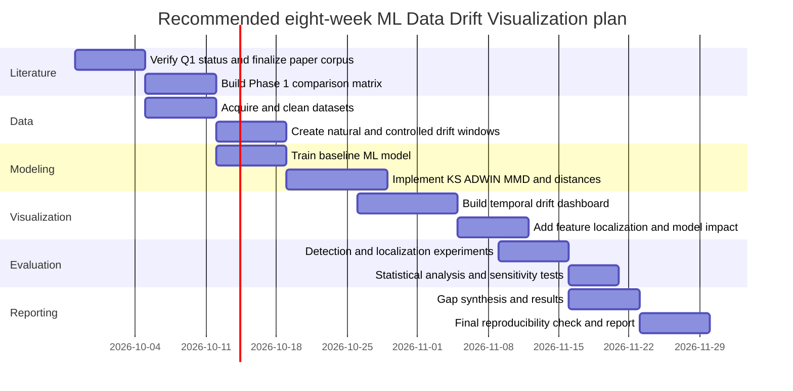

# Deep Research Report: ML Data Drift Visualization for Phase 1

## Executive summary

**Bottom line:** **ML Data Drift Visualization has excellent research potential and very strong AI-Engineering value, but there is an important Phase 1 risk that the earlier recommendation understated.** Your Phase 1 asks for roughly **8–10 Q1 journal papers from 2025/2026**, with datasets, methods, experiments and evaluation, and then asks you to synthesize limitations and research gaps. fileciteturn0file0L8-L20 fileciteturn0file0L29-L35

After a publisher-first search across Springer, IEEE, SAGE, arXiv, author repositories and research code, I found **10 genuinely relevant 2025–2026 candidates**, but I could **not responsibly verify 8–10 papers that are simultaneously all of the following**:

> **2025/2026 + Q1 journal + experimental research + sufficiently relevant to ML drift visualization/explanation/monitoring + accessible.**

That distinction matters. Several excellent papers are top-conference papers rather than Q1 journal papers; several are in new/unranked venues; one important Q1 paper is a **survey rather than an experimental study**; and the most directly visualization-focused papers are not necessarily your safest Q1 choices. SCImago's quartile system applies journal rankings, with Q1 denoting the highest quarter; a top conference such as MICCAI can be excellent research but does **not automatically satisfy a literal “Q1 journal” requirement**. citeturn13search21turn21search0

The good news is that the **research gap is unusually strong**. Recent papers separately solve pieces of the problem:

- Gâlmeanu & Andonie directly visualize temporal drift with **Parallel Histograms through Time**. citeturn17view0
- Szűcs & Németh try to answer **which features drifted**, not merely whether drift occurred. citeturn17view1turn18view3
- Greco et al.'s **DriftLens** handles unsupervised real-time drift in deep representations and characterizes drift by label; its own project still lists richer **drift explanations and DriftLens visualization** as future development. citeturn20search14 fileciteturn2file0L2-L2
- Roschewitz et al. go further toward **root-cause identification**, distinguishing prevalence, covariate and mixed shifts. citeturn20search2
- Guerrero Cano et al. show that merely reacting after drift occurs can be too late and investigate **proactive** adaptation. citeturn17view2turn18view5
- The 2026 image-stream survey explicitly concludes that drift in high-dimensional unstructured data remains much less developed than drift in tabular/time-series data. citeturn17view3

That combination gives you a very defensible research question:

> **Can an explainable visualization framework show not only whether ML data drift occurred, but when it occurred, which features caused it, how severe it was, and whether it actually affected model performance?**

### My recommendation

I would **keep your instructor's topic exactly within “ML Data Drift Visualization,” but broaden the research scope slightly to include detection, explanation and monitoring**:

> **Recommended final title:**  
> **“Explainable Visualization and Monitoring of Machine-Learning Data Drift in Dynamic Environments”**

For your actual implementation, I recommend the **tabular/MLOps variant** rather than immediately jumping into LLM drift. It is much safer academically, far easier to reproduce, gives you enough visualization work for the course, and is highly relevant to AI/ML Engineering.

My overall assessment is:

| Criterion | Assessment |
|---|---:|
| AI Engineering career relevance | **10/10** |
| Research-gap strength | **9.5/10** |
| Dataset availability | **9/10** |
| Implementation feasibility | **8.5/10** |
| Visualization potential | **9.5/10** |
| Novelty | **9/10** |
| Strict 2025–26 Q1-paper availability | **6/10 — main risk** |
| Overall, assuming older Q1/top-conference supplements allowed | **9/10** |

**Therefore: proceed with this topic if your instructor accepts closely related drift detection/explanation/monitoring papers and/or high-quality 2023–24 supplements. If she literally requires 8–10 experimental Q1 journal articles all published in 2025–26, I would not yet claim that this topic satisfies Phase 1.**

## Paper eligibility, ranking method, and the strongest candidates

I ranked papers specifically for **your project**, not simply by citation count. The score gives approximately **35% to Q1/top-tier venue quality, 30% to direct relevance to visualization/explanation/monitoring, 20% to open accessibility/reproducibility, and 15% to AI-engineering novelty**. I also apply a separate Phase 1 gate: a survey may be academically excellent but cannot substitute for an experimental paper if your Phase 1 explicitly expects datasets, methods and evaluation. fileciteturn0file0L11-L20

**Q1 note:** journal quartiles are category- and year-dependent. “Q1-safe” below means a venue that should be treated as a strong current Q1 candidate, but I strongly recommend saving the **2025 Scopus Sources/SCImago evidence** for the exact category before handing in Phase 1. I deliberately mark uncertain/new venues instead of pretending everything is Q1. SCImago itself defines Q1 as the highest quartile. citeturn13search21turn21search0

### Ranked recent literature

| Rank | Paper and full bibliographic citation | Venue / status | OA / paywall | Why it matters to your topic | Phase 1 verdict |
|---|---|---|---|---|---|
| **1** | **Greco, S., Vacchetti, B., Apiletti, D., & Cerquitelli, T. (2025). “Unsupervised Concept Drift Detection From Deep Learning Representations in Real-Time.” IEEE Transactions on Knowledge and Data Engineering, 37(10), 6232–6245. DOI: 10.1109/TKDE.2025.3593123.** citeturn20search10 | **IEEE TKDE; Q1-safe / elite data-engineering journal** | IEEE version may require access; **arXiv + author copy + code are free**. citeturn20search3turn20search14 | Probably the best AI-engineering paper here: real-time unsupervised monitoring, embeddings, drift characterization, NLP/CV/audio. | **A — Core experimental paper** |
| **2** | **Szűcs, G., & Németh, M. (2025). “Domino drift effect approach for probability estimation of feature drift in high-dimensional data.” Knowledge and Information Systems, 67, 4597–4621. DOI: 10.1007/s10115-025-02362-0.** citeturn17view1 | **KAIS; Q1-safe candidate** | **Gold OA; free PDF from Springer**. citeturn17view1 | Excellent bridge from detection → explanation: asks **which features caused drift** while reducing monitoring cost. | **A — Core experimental paper** |
| **3** | **Roschewitz, M., Mehta, R., Jones, C., & Glocker, B. (2025). “Automatic dataset shift identification to support root cause analysis of AI performance drift” / MICCAI version: “Automatic dataset shift identification to support safe deployment of medical imaging AI.” MICCAI 2025.** citeturn20search2turn20search6 | **MICCAI 2025; top conference, Q1 label N/A** | **arXiv CC-BY + public code**. citeturn20search9 | Very strong conceptual match for an explainable drift dashboard: detect shift, then identify its **type/root cause**. | **A experimentally, but not a Q1 journal** |
| **4** | **Guerrero Cano, J. V., Aguiar, G. J., & Cano, A. (2026). “Anticipating to Change: A Proactive Approach for Concept Drift Adaptation in Data Streams.” Machine Learning, 115, Article 3. DOI: 10.1007/s10994-025-06945-4.** citeturn17view2 | **Machine Learning; Q1-safe** | **Gold OA; Springer PDF**. citeturn17view2 | Strong for the “what should happen after monitoring?” part. Measures degradation and recovery rather than only detector accuracy. | **A — Core experimental paper** |
| **5** | **Gâlmeanu, H., & Andonie, R. (2025). “Concept drift detection and visualization with shifting window.” Information Visualization, 24(4), 412–428. DOI: 10.1177/14738716251365635.** citeturn17view0 | **Information Visualization; quartile needs exact 2025 institutional verification** | SAGE publisher access varies; **author full text has been made available separately**. | **Most directly relevant visualization paper** in the set; proposes Parallel Histograms through Time (PHT). | **A-/B+ — Essential topic paper, but verify Q1 and quantitative-evaluation fit** |
| **6** | **Agrahari, S., & Singh, A. K. (2025 volume). “Comparison based analysis of window approach for concept drift detection and adaptation.” Applied Intelligence, 55, Article 39. DOI: 10.1007/s10489-024-05890-4.** citeturn17view6 | **Applied Intelligence; Q1 candidate** | **Publisher paywall**; no stable free author manuscript was verified in this search. | Useful benchmark for window-based detection and early localization, but almost no visualization. | **A experimentally; year is borderline** |
| **7** | **Kraus, A., & van der Aa, H. (2025). “Machine learning-based detection of concept drift in business processes.” Process Science, 2, Article 5. DOI: 10.1007/s44311-025-00012-w.** citeturn17view4 | Process Science; **new venue / do not count as Q1 without evidence** | **Gold OA Springer PDF**. citeturn17view4 | Interesting visualization-adjacent idea: turns temporal process evolution into an **image** and detects drift using computer vision. | **A experimentally; C for strict Q1 count** |
| **8** | **Ziffer, G., & Della Valle, E. (2025). “Exploring Concept Drift Visualization and Explanation in Image Streams.” In Discovering Drift Phenomena in Evolving Landscapes, LNCS, pp. 86–98. DOI: 10.1007/978-3-031-82346-6_6.** citeturn20search0 | DELTA workshop / LNCS; **conference chapter, Q1 N/A** | Springer chapter may be restricted; public project repository available. citeturn20search8 | Extremely relevant to visual explanation; ResNet-50 + UMAP + natural image drift. | **B — Great supporting paper, not a Q1 journal** |
| **9** | **Tran, Q.-T., Le-Khac, N.-A., & Bertolotto, M. (2026). “Concept drift detection in image data stream: a survey on current literature, limitations and future directions.” Artificial Intelligence Review, 59, Article 33. DOI: 10.1007/s10462-025-11428-y.** citeturn17view3 | **Artificial Intelligence Review; Q1** | **Gold OA**. citeturn17view3 | Outstanding gap/taxonomy source; reviews 14 image-drift methods and identifies underexplored areas. | **B — Cite heavily, but do not count as one of your experimental papers** |
| **10** | **Zhang, T., Liu, S., Huang, S., et al. (2025). “Adaptive resampling and weighted ensemble method for dynamic imbalance data stream classification.” The Journal of Supercomputing, 81, Article 999. DOI: 10.1007/s11227-025-07482-6.** citeturn11search2 | Journal of Supercomputing; **do not count as Q1 without current category verification** | A public/preprint version was surfaced separately. citeturn11search6 | Useful for adaptation under simultaneous imbalance + drift; weak visualization relevance. | **B/C — backup, not first-choice Phase 1 paper** |

There is one particularly important bibliographic issue with Agrahari & Singh: Springer lists **27 November 2024** as the online publication date even though it is assigned to **volume 55 (2025)**. citeturn17view6 If your instructor interprets “2025 paper” by volume year, it may count; if she uses first-online publication date, it may not. **Do not silently assume.**

### What the strongest experimental papers actually do

| Paper | Datasets / data | Method | Evaluation | Main result | Important limitation |
|---|---|---|---|---|---|
| **Greco et al. — DriftLens** | AG News, 20 Newsgroups, Bias in Bios, MNIST, Intel-Image, STL-10, FairFace and Common Voice; models include BERT/DistilBERT/RoBERTa, VGG16, ViT and Wav2Vec. fileciteturn3file0L1-L2 | PCA-reduced deep embeddings; reference and window distributions; multivariate Gaussian modeling; **Fréchet distance**; global and per-label monitoring. fileciteturn2file0L2-L2 | Drift/no-drift detection, runtime, drift-score/severity correlation, parameter sensitivity. | Journal version reports outperforming competing approaches in **15/17 use cases**, at least **5× faster**, and drift curves correlated at **≥0.85** with true drift amount. citeturn20search14 | Much evaluation uses controlled/simulated shifts; embedding choice matters. Crucially for **your project**, visualization is still listed as future development in the public project. fileciteturn2file0L2-L2 |
| **Szűcs & Németh — DDE** | Four real-world datasets; public implementation identifies Covertype, CICIDS, Insects and Heartbeats. citeturn17view1turn5search6 | **Domino Drift Effect** uses correlations/co-drifting so a subset of monitored features predicts drift probability in other features. | 10-fold runs; **F1 and AUC**, resource use, runtime, comparison with alternatives. citeturn18view3 | DDE obtained the highest recall and F1 in almost all reported Heartbeats/Insects comparisons. citeturn18view3 | Depends on exploitable correlation/co-drift; benefit can weaken when features drift independently. |
| **Roschewitz et al.** | Publicly obtainable medical-imaging datasets include **PadChest, RSNA Pneumonia, NIH data, MESSIDOR-v2, APTOS, Kaggle Diabetic Retinopathy and EMBED**. fileciteturn5file0L1-L2 | Combines model-output tests (**BBSD**), **MMD** on encoder features, prevalence estimation and reference resampling to distinguish prevalence, covariate and mixed shifts. fileciteturn5file0L1-L2 | Repeated/bootstrap shift-detection and shift-type-identification experiments across acquisition, gender and prevalence shifts. fileciteturn5file0L1-L2 | Provides root-cause category rather than merely a shift alarm. citeturn20search2 | Medical-imaging-centric; several shifts are intentionally constructed; considerably heavier project setup than tabular drift. |
| **Guerrero Cano et al.** | Controlled synthetic streams plus standard real-world binary classification streams. citeturn18view4 | Four proactive strategies derived from **Very Fast Decision Trees**, exploiting trajectories/trends to adapt before degradation. | Prequential accuracy, degradation episodes, recovery time, statistical tests, drift-speed and window-size sensitivity. citeturn18view5 | Best method reached aggregated prequential accuracy **0.9574 vs 0.9406** for reactive VFDT, with fewer degradation episodes; benefits remain across several incremental-drift speeds. citeturn18view5 | Abrupt drift provides too little trajectory information; under abrupt shifts approaches converge to roughly 0.82 accuracy. citeturn18view5 |
| **Gâlmeanu & Andonie — PHT** | Synthetic **CIRCLES/SINE1** and real drift benchmarks including **WEATHER/ELECTRICITY**; the study also demonstrates multidimensional drift visualization. citeturn17view0 | **Parallel Histograms through Time**, a moving-window visual representation inspired by parallel coordinates/histograms. | Experimental case studies across different drift patterns; emphasis is visual interpretation rather than conventional detector leaderboards. | Makes changes across features/windows directly inspectable and connects drift visualization with explanation/causal investigation. citeturn17view0 | Quantitative comparative evaluation is weaker than detector papers; human-centered validation is an obvious next step. |
| **Agrahari & Singh** | Synthetic and real streaming datasets. | DD-SCC-I/DD-KRC-I single-window detectors and corresponding two-window approaches using **Spearman and Kendall rank correlations**. citeturn17view6 | Detection timing/occurrence and predictive classification comparisons. | Designed to reduce the delay caused by waiting for a second comparison window and localize change earlier. citeturn17view6 | Very detection-centric; essentially no contribution to user-facing visualization; access and year ambiguity reduce usefulness for your Phase 1. |
| **Kraus & van der Aa — CV4CDD-4D** | Synthetic **CDLG** and **CDRIFT** event-log collections plus real-life event logs. citeturn18view6turn18view7 | Converts temporal event logs into images and fine-tunes **RetinaNet** to identify sudden, gradual, incremental and recurring drift. citeturn17view4turn18view7 | Precision, recall, F1 at several allowed latencies; noise robustness; sensitivity analysis. | CDLG F1 is roughly **0.81–0.83**; on CDRIFT it reaches **0.92** at 2.5%/5% latency. It remains around 0.81 F1 even with 60% noisy traces in one test. citeturn18view6turn18view7 | Highly domain-specific; supervised approach depends heavily on generated labeled drift scenarios. |
| **Ziffer & Della Valle** | **CLEAR10**, designed around natural temporal evolution of visual concepts. fileciteturn4file0L1-L2 | Pretrained **ResNet-50**, zero-shot classification and **UMAP** to identify and visualize drift in image embeddings. fileciteturn4file0L1-L2 | Primarily visual/qualitative analysis of temporal embedding evolution. | Shows a plausible way to turn high-dimensional visual drift into a human-interpretable low-dimensional representation. | Small workshop paper; weaker quantitative validation; public repository stated code was still being prepared. fileciteturn4file0L1-L2 |
| **Tran et al.** | No new experimental dataset: systematic review/taxonomy of **14 representative methods**. citeturn17view3 | Taxonomy based on image-feature handling, strategy, detection level, drift causes and evaluation characteristics. | Comparative literature synthesis rather than a new detector experiment. | Demonstrates that dedicated image-stream drift work remains limited and highlights computational/memory requirements and high-dimensional representations. citeturn17view3 | **Does not meet your “own datasets + experiments + evaluation” criterion as a primary paper.** Use it for literature review and gaps. |
| **Zhang et al. — ARWE** | Dynamic imbalanced data streams. | Adaptive resampling plus weighted ensembles, including Hellinger-distance-related mechanisms. citeturn11search2 | Stream-classification metrics across evolving imbalance/drift settings. | Shows the interaction between drift and class imbalance rather than treating drift alone. | Weak connection to visualization/explanation; therefore not an efficient use of one of only 8–10 Phase 1 slots. |

**Most important conclusion from this table:** the direct **visualization** literature is much thinner than the broader **drift-detection** literature. That is simultaneously the project's **research opportunity** and its **Phase 1 bibliographic risk**. The 2026 survey itself says image-stream drift remains underexplored and had to broaden its scope because dedicated methods are limited. citeturn17view3

### High-quality older supplements

Because the verified 2025–26 pool does not safely give you eight experimental Q1 journal papers, these are useful supplements. They should **not be disguised as 2025–26 papers**.

| Supplement | Why it belongs |
|---|---|
| **Hinder, F., Vaquet, V., & Hammer, B. (2023). “Model-based explanations of concept drift.” Neurocomputing, 555, 126640.** | One of the clearest predecessors for the **explanation** side of your proposed study; useful when arguing that alarms alone are insufficient. It is also referenced by the newer visualization literature. |
| **Adams, J. N., et al. (2023). “Explainable concept drift in process mining.” Information Systems.** citeturn15search27 | Directly relevant to converting detected process change into something a human can interpret; especially valuable for your “explanation after detection” literature subsection. |
| **Gâlmeanu, H., & Andonie, R. (2024). “Concept drift visualization of SVM with shifting window.” IEEE Information Visualisation.** | Direct precursor to the authors' 2025 PHT work; valuable for tracing how the visualization method developed. |
| **Greco, S., Vacchetti, B., Apiletti, D., Cerquitelli, T., et al. (2024). “DriftLens: A Concept Drift Detection Tool.” Advances in Database Technology/EDBT, 27, 806–809.** The project provides a freely accessible proceedings paper. fileciteturn2file0L2-L2 | Useful practical bridge from research algorithm → monitoring tool; excellent AI Engineering/MLOps context, although it should not be counted as one of the main Q1 experimental articles. |

## Research gaps and what you could actually contribute

The literature gives you a much stronger research gap than “different algorithms have different accuracy.” That would be too generic. The strongest gap is that **detection, explanation, visualization, and model-impact assessment are still fragmented into separate systems**.

**Detection without diagnosis is the clearest gap.** Szűcs & Németh explicitly begin from the problem that conventional drift detectors can determine that drift occurred but do not tell the practitioner which specific features caused it. Their DDE approach addresses feature localization, but it does so algorithmically rather than developing a complete human-facing monitoring system. citeturn17view1 This creates a natural visualization question: once a feature-level probability is available, **how should an AI engineer see and prioritize it?**

**Visualization is underdeveloped relative to detection.** Gâlmeanu & Andonie focus specifically on this gap by developing PHT rather than yet another scalar alarm. citeturn17view0 Ziffer & Della Valle similarly call image-stream drift visualization and explanation an overlooked problem and use ResNet-50/UMAP on CLEAR10. fileciteturn4file0L1-L2 Most detector papers still output statistics, thresholds, alarms or drift scores rather than an integrated explanation.

**There is a particularly strong deep-learning gap.** DriftLens makes a major step toward production-relevant monitoring because it works on unstructured deep-learning representations without requiring immediate ground-truth labels. It spans text, images and speech and can characterize drift at label level. citeturn20search14 Yet the public project itself still explicitly lists **drift explanations** and **DriftLens visualization** as future development, making “visual explanation of embedding drift” a defensible extension rather than an invented gap. fileciteturn2file0L2-L2

**Root cause remains different from simple feature shift.** Roschewitz et al. show why a detected difference may have qualitatively different explanations: prevalence shift, covariate shift, or a combination of both. Their pipeline therefore performs identification after detection. citeturn20search2 Your project could translate the same principle into tabular ML: a dashboard should communicate **type + location + severity + downstream model effect**, not just “p < 0.05.”

**Evaluation is fragmented.** Different papers optimize different outcomes: DDE reports F1/AUC and efficiency; CV4CDD studies F1 under detection latency and noise; proactive adaptation measures prequential accuracy, performance-degradation episodes and recovery time; DriftLens additionally evaluates runtime and correlation between its score and true drift severity. citeturn18view3turn18view5turn18view7turn20search14 This means two papers can both claim “better drift detection” while measuring meaningfully different things. A unified experiment using the same datasets, drift windows and metrics is a real methodological contribution.

**Drift detection is not the same thing as model degradation.** A statistically significant change in \(P(X)\) does not automatically imply a practically important decrease in predictive performance. Production monitoring therefore benefits from plotting drift signals **together with model-quality trajectories**, particularly when labels arrive later. Current production guidance likewise distinguishes data drift, prediction drift and concept/model-quality degradation rather than treating them as interchangeable. citeturn19search2turn15search7 A strong student project can explicitly measure **correlation between drift-score magnitude and performance loss**.

**Generalizability is weak.** Classical studies often use tabular benchmarks; CV4CDD is specific to process logs; Roschewitz et al. focus on medical imaging; Ziffer & Della Valle focus on image streams; DriftLens is broad in modality but generates many controlled shift scenarios. citeturn18view7turn17view3 fileciteturn3file0L1-L2 A multi-dataset evaluation across at least one natural temporal stream and one controlled drift stream would therefore be stronger than evaluating a new chart on only one dataset.

That produces a clean research-gap statement suitable for Phase 1:

> **Existing drift-monitoring methods predominantly emphasize accurate detection, while feature-level localization, visual explanation, model-impact assessment and user-interpretable temporal monitoring are usually studied separately. There is therefore room for a unified visualization framework that compares multiple drift detectors, identifies which features drive a detected shift, shows how drift evolves over time, and relates the detected shift to downstream ML performance.** This is an inference from the complementary limitations of recent visualization, feature-localization, embedding-monitoring and root-cause work. citeturn17view0turn17view1turn20search14turn20search2

This also maps almost perfectly onto the gap categories your Phase 1 asks you to discuss—dataset limitations, methodological limitations, evaluation limitations, generalizability, missing experiments and future directions. fileciteturn0file0L29-L35

## Recommended research pathway

**Final topic:**

> ### **Explainable Visualization and Monitoring of Machine-Learning Data Drift in Dynamic Environments**

This remains **inside your instructor's “ML Data Drift Visualization” topic** rather than inventing a different project. fileciteturn0file0L75-L86

**Primary research question:**

> **How effectively can different statistical and window-based drift detectors detect and localize temporal data drift, and how can visualization communicate the drift's timing, responsible features, severity, and relationship with model-performance degradation?**

A useful secondary question is:

> **Does a larger statistical drift score reliably correspond to a larger decline in predictive model performance?**

That second question matters because it moves the project beyond “make a dashboard” into an actual analytical research study.

### Recommended literature corpus

For Phase 1, I would start with these **eight priority papers**, but label their bibliographic status honestly:

| Priority | Paper | Role in your literature review |
|---|---|---|
| **Must use** | Greco et al. 2025 — DriftLens | Unsupervised real-time deep/embedding drift + characterization |
| **Must use** | Szűcs & Németh 2025 — DDE | Feature-level localization/explanation |
| **Must use** | Gâlmeanu & Andonie 2025 — PHT | Direct drift visualization |
| **Must use** | Guerrero Cano et al. 2026 | Temporal/proactive monitoring and model degradation |
| **Strong** | Roschewitz et al. 2025 MICCAI | Shift root-cause identification |
| **Strong** | Agrahari & Singh, 2025 volume | Window/correlation-based drift detection; verify date rule |
| **Gap source** | Tran et al. 2026 | Q1 survey; use for taxonomy/gaps, not as experimental replacement |
| **Supplement** | Hinder et al. 2023 | Explainable concept drift |

Then add Adams et al. 2023, Kraus & van der Aa 2025 or Ziffer & Della Valle 2025 depending whether the instructor values **Q1 status** or **direct visualization relevance** more.

I would **not submit a Phase 1 table claiming that all eight above are 2025–26 Q1 experimental journal papers**. They are not. Before final submission, the year/category evidence should be checked in your institution's **Scopus Sources / Web of Science** interface.

### Dataset options

| Dataset | Type | Natural or constructed drift | Access / setup | Why useful | Recommendation |
|---|---|---|---|---|---|
| **Electricity / ELEC** | Tabular temporal classification | Mostly natural temporal evolution | Easy / public benchmark | Classic drift stream and appears in visualization literature. citeturn17view0 | **★★★★★ Best primary dataset** |
| **Weather** | Tabular temporal | Natural | Easy | Time ordering makes change intuitive to visualize; also used in PHT experiments. citeturn17view0 | **★★★★★** |
| **Covertype** | Tabular | Can be streamed/ordered; DDE also uses a controlled setting | Easy | Many features, excellent for feature-level drift heatmaps. citeturn18view3 | **★★★★☆** |
| **Insects** | Multivariate stream | Natural drift patterns | Moderate | DDE reports strong feature-level experiments on it. citeturn18view3 | **★★★★☆** |
| **Synthetic SINE/CIRCLES/SEA-style streams** | Tabular | Known drift location/type | Very easy | Gives you ground truth for detection delay, localization accuracy and false alarms. PHT explicitly uses synthetic streams. citeturn17view0 | **★★★★★ as secondary benchmark** |
| **CLEAR10** | Images over time | Natural temporal visual evolution | Moderate/high | Directly designed for image concept evolution; ideal for UMAP/embedding visualization. fileciteturn4file0L1-L2 | **★★★☆☆** |
| **AG News / 20 Newsgroups** | Text | Controlled semantic drift | Moderate | DriftLens demonstrates how transformer embeddings can be monitored. fileciteturn3file0L1-L2 | **★★★☆☆** |
| **MNIST/STL-10** | Images | Controlled class/covariate shifts | Easy/moderate | DriftLens has reproducible image scenarios with VGG/ViT. fileciteturn3file0L1-L2 | **★★★☆☆** |
| **PadChest/RSNA/MESSIDOR/APTOS/EMBED** | Medical images | Acquisition, prevalence, demographic shifts | High | Excellent real-world importance and root-cause research, but substantial preprocessing. fileciteturn5file0L1-L2 | **★★☆☆☆ for this course** |

**Best combination:** use **Electricity + Covertype/Insects + one synthetic stream**. The synthetic stream gives known ground-truth change points; Electricity gives realism; Covertype/Insects gives high-dimensional feature localization. That triangulation directly addresses the generalizability problem seen across the literature.

### Methods worth implementing

You do **not** need to invent a mathematically complicated new drift detector. For Data Analysis & Visualization, a stronger design is to systematically compare established methods and contribute the **integrated explanation/visualization layer**.

I recommend comparing:

| Family | Method | What it tests / contributes |
|---|---|---|
| Univariate statistical | **Kolmogorov–Smirnov test** | Detect distribution change per numerical feature |
| Distribution distance | **Wasserstein distance** | Measures how far distributions move |
| Distribution distance | **Jensen–Shannon divergence** | Useful bounded distribution comparison |
| Window detector | **ADWIN** | Adaptive temporal-window drift detection |
| Multivariate | **MMD** | Detects multivariate distribution shift; also used in recent root-cause work. fileciteturn5file0L1-L2 |
| Feature explanation | Correlation/localization inspired by **DDE** | Identify the features most associated with detected change. citeturn17view1 |
| Optional advanced | Embedding Fréchet distance inspired by **DriftLens** | Excellent extension if you use image/text embeddings. fileciteturn2file0L2-L2 |

Your visualization layer should combine a **global drift timeline**, **feature × time heatmap**, **before/after feature distributions**, **ranked drifting-feature panel**, and **model-performance curve overlaid with drift events**. A PHT-style multivariate view can be included as an advanced comparison rather than recreating the whole SAGE paper. citeturn17view0

### Evaluation plan

Your detector evaluation should include **precision, recall, F1, false-positive rate and detection delay** wherever known change points exist. This follows the direction of recent papers that evaluate classification-quality and timing/latency rather than simply displaying a p-value. citeturn18view3turn18view7

Your feature-explanation evaluation can be stronger than much existing visualization work. Introduce drift intentionally into known features and calculate:

\[
\text{Localization Precision}=
\frac{\text{correctly identified drifting features}}
{\text{all features identified as drifting}}
\]

and

\[
\text{Localization Recall}=
\frac{\text{correctly identified drifting features}}
{\text{true drifting features}}
\]

For model impact, train a simple **Random Forest/XGBoost/logistic model** on the initial period and track accuracy, F1 or ROC-AUC across subsequent windows. Then test the relationship between **drift magnitude and performance loss**, for example using Spearman correlation. This directly addresses the difference between “the distribution changed” and “the model actually became worse.”

A particularly strong result would look like:

> KS detects many feature shifts but generates more isolated alerts; ADWIN gives cleaner temporal change points; MMD catches multivariate changes missed by some univariate tests; the visualization shows which features drive those alarms; only a subset of alarms strongly coincide with a model-performance drop.

That is a much more substantive DAV project than simply displaying charts.

### Expected contribution

Your contribution should **not** be claimed as “a new state-of-the-art concept drift detector.” The evidence does not require that. A defensible contribution would instead be:

> **A reproducible, explainable drift-monitoring framework that unifies statistical drift detection, feature-level localization, temporal visualization and ML-performance monitoring, evaluated consistently across synthetic and real-world data streams.**

That directly combines pieces that current papers often address separately. citeturn17view0turn17view1turn20search14turn20search2

## Project variants and timeline

| Priority | Project variant | Core idea | Major pros | Major cons | Difficulty | Career value |
|---|---|---|---|---|---:|---:|
| **🥇 Recommended** | **Tabular Data + MLOps Drift Visualization** | Electricity/Weather/Covertype; compare KS, Wasserstein, JS, ADWIN/MMD; build feature/time/model-impact dashboard | Best balance of research rigor, visualization, reproducibility and production-ML relevance; known benchmarks; cheap compute | Less flashy than transformers/LLMs | **6/10** | **10/10** |
| **🥈 Advanced** | **Deep-Learning / Embedding Drift Visualization** | Use AG News/MNIST/STL-10/CLEAR10; compare embedding distributions and visualize with UMAP + DriftLens-inspired scores | Excellent AI-engineering portfolio; very close to current research; strong explainability gap | GPU work, dimensionality reduction, more variables, harder evaluation | **8/10** | **10/10** |
| **🥉 Frontier** | **LLM / Text-Embedding Drift Monitoring** | Monitor semantic change in prompts/documents over time through embedding distributions and cluster movement | Very current, impressive portfolio, could connect to RAG/LLM monitoring | Weakest direct Phase 1 literature base, difficult ground truth, harder to prove “true” drift, risk of becoming too broad | **9/10** | **10/10** |

The **tabular/MLOps version is the best academic choice**. The deep-learning variant is the best stretch goal. I would not choose LLM drift for this course unless the instructor explicitly encourages exploratory work, because you would be adding literature risk on top of an already narrow 2025–26 Q1 requirement.



A good milestone rule is: **do not build the dashboard first**. First create known drift windows and verify that at least two or three detectors produce meaningfully different behavior. Then the visualization has actual research content to communicate.

## Open-access paper pack and paywall strategy

These are the papers I would download **first**, specifically because you said paywalls are a problem.

| Priority | Paper | Access | Direct access |
|---|---|---|---|
| **1** | Greco et al. 2025 — DriftLens | **Free arXiv preprint; journal paper also has author copy**. citeturn20search3turn20search14 | [arXiv PDF](https://arxiv.org/pdf/2406.17813) |
| **2** | Szűcs & Németh 2025 — Domino Drift Effect | **Gold Open Access Springer**. citeturn17view1 | [Springer OA article/PDF](https://link.springer.com/article/10.1007/s10115-025-02362-0) |
| **3** | Guerrero Cano et al. 2026 — Anticipating to Change | **Gold Open Access Springer**. citeturn17view2 | [Springer OA article/PDF](https://link.springer.com/article/10.1007/s10994-025-06945-4) |
| **4** | Tran et al. 2026 — Image Drift Survey | **Gold Open Access Springer**. citeturn17view3 | [Springer OA article/PDF](https://link.springer.com/article/10.1007/s10462-025-11428-y) |
| **5** | Kraus & van der Aa 2025 — CV4CDD-4D | **Gold Open Access Springer**. citeturn17view4 | [Springer OA article/PDF](https://link.springer.com/article/10.1007/s44311-025-00012-w) |
| **6** | Roschewitz et al. — dataset-shift root cause, MICCAI 2025 | **Free arXiv + public reproducibility code**. citeturn20search2turn20search9 | [arXiv paper](https://arxiv.org/abs/2411.07940) |
| **7** | Gâlmeanu & Andonie 2025 — PHT | SAGE version may depend on access; an author-accessible/full-text route was surfaced in the search. citeturn17view0 | [Publisher DOI page](https://doi.org/10.1177/14738716251365635) |
| **8** | Ziffer & Della Valle 2025 — image-stream visualization | Springer chapter may be restricted; **institutional research record + public repository** available. citeturn20search11turn20search8 | [Politecnico repository](https://re.public.polimi.it/handle/11311/1287730) |
| **9 — supplement** | Greco et al. 2024 — DriftLens tool | **Free EDBT proceedings PDF**. fileciteturn2file0L2-L2 | [OpenProceedings PDF](https://openproceedings.org/2024/conf/edbt/paper-239.pdf) |
| **10 — backup** | Zhang et al. 2025 — ARWE | A public author/preprint copy was surfaced even though publisher access may differ. citeturn11search6 | Use the public author copy surfaced through ResearchGate/Research Square |

The most problematic current paper is **Agrahari & Singh**: it is valuable and in a strong journal, but Springer does not mark the page as OA, and the freely indexed ResearchGate result did not provide a reliable public full-text download. citeturn17view6 I would therefore use it only if your university library provides access or an author manuscript becomes available.

The important point is that **you do not need to base the project on eight paywalled papers**. DriftLens, DDE, Anticipating to Change, CV4CDD, the image-drift survey and the MICCAI root-cause work give you a substantial openly readable technical foundation. citeturn17view1turn17view2turn17view3turn17view4turn20search3turn20search2

## Search strategy, exact queries, and final recommendation

The search was deliberately **publisher-first**, rather than relying on blog posts or generic Google results. Primary sources were preferred in this order: **IEEE Computer Society/IEEE Xplore, Springer Nature, SAGE, conference proceedings, arXiv, institutional repositories and author GitHub repositories**. Google Scholar/semantic search results were used for discovery; SCImago should be used to verify journal quartiles; your institutional **Scopus** or **Web of Science** access should be treated as the final authority for whatever Q1 rule your instructor applies. Springer's pages were particularly useful because they expose publication dates, article type, OA status, methods and experimental results directly. citeturn17view1turn17view2turn17view3turn17view4

The exact search strings used included:

```text
"concept drift" 2025 site:link.springer.com/article machine learning drift detection

"concept drift" 2025 site:ieeexplore.ieee.org drift detection data stream

"dataset shift" 2025 site:arxiv.org/abs detection root cause

"concept drift" 2026 site:link.springer.com/article "Machine Learning"

"concept drift" "2025" "explainable" machine learning paper

"data drift" "2025" "explainability" machine learning

"concept drift" 2025 "Knowledge and Information Systems"

"concept drift" 2025 "Information Sciences" data stream

"concept drift" 2025 site:sciencedirect.com/science/article machine learning data stream

"concept drift" 2025 site:link.springer.com/article detector stream open access

"data drift" 2025 site:ieeexplore.ieee.org/document machine learning monitoring

"dataset shift" 2025 site:dl.acm.org/doi machine learning detection

"Exploring Concept Drift Visualization and Explanation in Image Streams"

"Unsupervised Characterization of Temporal Dataset Shifts as Principal Component Variations in Clinical Data"

"Automatic dataset shift identification to support root cause analysis"

"Unsupervised Concept Drift Detection from Deep Learning Representations in Real-time"

SCImago Information Visualization journal Q1 2025

SCImago Knowledge and Information Systems journal Q1 2025

SCImago Machine Learning journal Q1 2025

SCImago IEEE Transactions on Knowledge and Data Engineering Q1 2025
```

For your own Scopus search, I would use a structured query close to:

```text
TITLE-ABS-KEY(
  ("data drift" OR "concept drift" OR "dataset shift" OR "distribution shift")
  AND
  (visual* OR explain* OR monitor* OR "root cause" OR detect*)
)
AND PUBYEAR > 2024
AND PUBYEAR < 2027
```

Then filter to **Article**, **Computer Science / AI / Information Systems**, and **Q1 source**. A second narrower query for the visualization core should be:

```text
TITLE-ABS-KEY(
  ("concept drift" OR "data drift")
  AND
  (visualization OR visualisation OR "visual analytics" OR explainability)
)
AND PUBYEAR > 2024
AND PUBYEAR < 2027
```

A third query designed to catch production-AI papers should be:

```text
TITLE-ABS-KEY(
  ("data drift" OR "concept drift" OR "distribution shift")
  AND
  ("model monitoring" OR MLOps OR deployment OR production)
)
AND PUBYEAR > 2024
AND PUBYEAR < 2027
```

### Final judgment

**I recommend the topic, but not under the simplistic interpretation “I will find ten papers about charts for data drift.”** The literature is not deep enough yet for that to be a safe Phase 1 strategy.

The academically stronger interpretation is:

> **ML Data Drift Visualization = drift detection + temporal monitoring + feature/root-cause explanation + visual analytics + relationship to ML model degradation.**

That formulation is supported by the current literature: PHT provides visualization, DDE feature localization, DriftLens real-time embedding monitoring and characterization, Roschewitz et al. root-cause identification, and Guerrero Cano et al. model-degradation/adaptation analysis. citeturn17view0turn17view1turn20search14turn20search2turn18view5

My **top three project choices within this one instructor-approved topic** are therefore:

| Choice | Exact project | Why |
|---|---|---|
| **🥇 Best overall** | **Explainable Visualization and Monitoring of ML Data Drift in Tabular Data Streams** | Safest datasets, clearest evaluation, strongest DAV content, excellent MLOps/AI Engineering value |
| **🥈 Best AI portfolio** | **Visualization and Explanation of Drift in Deep-Learning Embedding Spaces** | Directly extends DriftLens/Ziffer-style work and is highly relevant to modern AI systems |
| **🥉 Most novel / riskiest** | **Visual Monitoring of Semantic and Embedding Drift in LLM-Based Systems** | Excellent future relevance but currently weaker Phase 1 literature and harder ground-truth evaluation |

For **Phase 1**, I would choose the **first variant**. It gives you a defensible research gap, open datasets, quantitative evaluation, visualization depth, reproducibility, and a direct story for an AI Engineering interview: **you built and evaluated a production-style system that detects distribution change, explains what changed, and shows whether the deployed model is actually degrading.**

The only unresolved issue is bibliographic rather than technical: **the open-web evidence does not yet justify claiming that you have 8–10 experimental Q1 journal papers all dated 2025–2026.** Given that this is an explicit Phase 1 condition, that fact should be treated seriously rather than hidden. fileciteturn0file0L8-L20 The topic becomes much safer if your instructor accepts either **closely related 2025–26 top-conference work** or **high-quality 2023–24 Q1 supplements** alongside the newest papers.